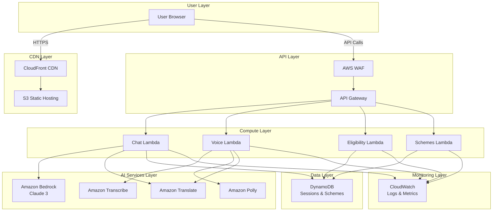

# Design Document: Bharat Sahayak AI Assistant

## Overview

Bharat Sahayak is a production-ready, multilingual AI welfare assistant platform built on AWS serverless architecture. The system enables Indian citizens to discover and access government welfare schemes through natural conversation in 11 languages with voice interaction capabilities.

### Core Design Principles

1. **Serverless-First**: Zero server management using AWS Lambda, API Gateway, DynamoDB, S3, and CloudFront
2. **Privacy-First**: Minimal data collection with automatic 24-hour session expiration
3. **Explainable AI**: Rule-based eligibility checking with transparent decision explanations
4. **Multilingual**: Native support for 11 Indian languages with automatic detection
5. **Accessible**: WCAG 2.1 AA compliance with voice input/output for low-literacy users
6. **Premium UX**: Apple-level UI with glassmorphism, smooth animations, and micro-interactions
7. **Cost-Optimized**: Pay-per-use pricing with caching and throttling strategies
8. **Scalable**: Auto-scaling serverless components handling variable traffic

### Technology Stack

**Frontend**: React 18, TypeScript, Tailwind CSS, Framer Motion, Vite
**Backend**: Python 3.12, AWS Lambda, API Gateway REST API
**Database**: DynamoDB with on-demand capacity
**AI Services**: Amazon Bedrock (Claude 3), Amazon Transcribe, Amazon Polly, Amazon Translate
**Infrastructure**: AWS SAM, CloudFormation
**Monitoring**: CloudWatch Logs, CloudWatch Metrics, CloudWatch Alarms
**Security**: AWS WAF, AWS KMS, IAM, HTTPS-only

## Architecture

### High-Level Architecture




### Architecture Decisions

**1. Serverless Architecture**
- **Decision**: Use AWS Lambda + API Gateway instead of EC2/ECS
- **Rationale**: Zero server management, automatic scaling, pay-per-use pricing, built-in high availability
- **Trade-offs**: Cold start latency (mitigated with provisioned concurrency for critical functions)

**2. DynamoDB for Data Storage**
- **Decision**: Use DynamoDB instead of RDS/Aurora
- **Rationale**: Serverless, single-digit millisecond latency, automatic scaling, TTL for session expiration
- **Trade-offs**: NoSQL data modeling complexity (acceptable for simple session and scheme data)

**3. Amazon Bedrock for LLM**
- **Decision**: Use Bedrock Claude 3 instead of self-hosted models
- **Rationale**: Managed service, no infrastructure, built-in security, pay-per-token pricing
- **Trade-offs**: Vendor lock-in (mitigated with abstraction layer)

**4. CloudFront + S3 for Frontend**
- **Decision**: Static hosting instead of server-rendered
- **Rationale**: Global CDN distribution, low latency, cost-effective, high availability
- **Trade-offs**: No server-side rendering (acceptable for SPA architecture)

**5. Rule-Based Eligibility Engine**
- **Decision**: Deterministic rules instead of AI-based eligibility
- **Rationale**: Explainability, fairness, auditability, no bias risk
- **Trade-offs**: Manual rule maintenance (acceptable for transparency requirements)


## Components and Interfaces

### Frontend Components

#### 1. Landing Page Component

**Purpose**: Engage users and communicate platform value

**Key Elements**:
- Animated gradient background (saffron-white-green theme)
- Floating AI orb with particle effects
- Feature showcase sections with parallax scrolling
- Architecture transparency section
- CTA button with hover effects

**Animations**:
- Gradient animation: 15s infinite loop
- AI orb: Floating animation with glow pulse
- Parallax: 0.5x scroll speed for background elements
- Hover effects: Scale 1.05, transition 300ms

**State Management**:
```typescript
interface LandingPageState {
  scrollPosition: number;
  isDarkMode: boolean;
  isLowBandwidth: boolean;
}
```

#### 2. Chat Interface Component

**Purpose**: Provide conversational interaction with the AI assistant

**Key Elements**:
- Message history with auto-scroll
- Text input with character counter
- Voice input button with waveform visualization
- Scheme cards with glassmorphism
- Typing indicator with animated dots
- Shimmer loading states

**Animations**:
- Message slide-in: translateY(-20px) → 0, opacity 0 → 1, 300ms
- Typing indicator: Dot bounce animation, 1.4s infinite
- Voice button morph: Circular → waveform, 200ms
- Scheme card entrance: Scale 0.95 → 1, opacity 0 → 1, 400ms

**State Management**:
```typescript
interface ChatState {
  messages: Message[];
  sessionId: string;
  isLoading: boolean;
  isVoiceActive: boolean;
  selectedLanguage: SupportedLanguage;
  isDarkMode: boolean;
  isLowBandwidth: boolean;
}

interface Message {
  id: string;
  role: 'user' | 'assistant';
  content: string;
  timestamp: number;
  schemes?: SchemeCard[];
}

interface SchemeCard {
  id: string;
  name: string;
  description: string;
  eligibilitySummary: string;
  applicationSteps: string[];
}
```

#### 3. About Page Component

**Purpose**: Provide transparency about platform architecture and AI principles

**Key Elements**:
- AWS architecture diagram (interactive SVG)
- AI transparency explanation
- Privacy policy section
- Bias prevention measures
- Rule-based eligibility explanation

**State Management**:
```typescript
interface AboutPageState {
  activeSection: 'architecture' | 'ai' | 'privacy' | 'bias';
  isDarkMode: boolean;
}
```

#### 4. Voice Input Component

**Purpose**: Capture and process voice input

**Key Elements**:
- Microphone button with ripple animation
- Waveform visualization during recording
- Language detection indicator
- Audio quality feedback

**Implementation**:
```typescript
interface VoiceInputProps {
  onTranscript: (text: string, language: SupportedLanguage) => void;
  onError: (error: VoiceError) => void;
}

interface VoiceInputState {
  isRecording: boolean;
  audioLevel: number;
  detectedLanguage?: SupportedLanguage;
}
```

**Audio Processing**:
- Sample rate: 16kHz (optimized for Transcribe)
- Format: WebM Opus (browser native)
- Max duration: 60 seconds
- Silence detection: Stop after 2s silence


#### 5. Scheme Card Component

**Purpose**: Display scheme information with visual hierarchy

**Design Specifications**:
- Glassmorphism: backdrop-blur-lg, bg-white/10, border-white/20
- Padding: 24px
- Border radius: 16px
- Shadow: 0 8px 32px rgba(0,0,0,0.1)

**Layout**:
```typescript
interface SchemeCardProps {
  scheme: {
    name: string;
    description: string;
    eligibilitySummary: string;
    applicationSteps: string[];
    officialLink?: string;
  };
  onCheckEligibility: () => void;
}
```

**Visual Hierarchy**:
1. Scheme name (text-xl, font-semibold)
2. Description (text-sm, opacity-80)
3. Eligibility summary (text-sm, badge style)
4. Application steps (numbered list)
5. CTA button (Check Eligibility)

#### 6. Low Bandwidth Mode Component

**Purpose**: Optimize experience for slow connections

**Optimizations**:
- Disable all animations
- Reduce image quality to 50%
- Lazy load non-critical resources
- Use compressed audio (Opus 24kbps)
- Minimize API payload sizes

**Detection Logic**:
```typescript
function detectSlowConnection(): boolean {
  const connection = (navigator as any).connection;
  if (!connection) return false;
  
  return (
    connection.effectiveType === 'slow-2g' ||
    connection.effectiveType === '2g' ||
    connection.saveData === true
  );
}
```

### Backend Components

#### 1. Chat Lambda Function

**Purpose**: Process text queries and generate AI responses

**Handler**: `chat_handler.py::lambda_handler`

**Input**:
```python
{
  "sessionId": "uuid-v4",
  "message": "string",
  "language": "en|hi|mr|ta|te|bn|gu|kn|ml|pa|or"  # optional, auto-detected
}
```

**Output**:
```python
{
  "response": "string",
  "language": "string",
  "schemes": [
    {
      "id": "string",
      "name": "string",
      "description": "string",
      "eligibilitySummary": "string",
      "applicationSteps": ["string"]
    }
  ],
  "sessionId": "string"
}
```

**Processing Flow**:
1. Validate request format
2. Retrieve session context from DynamoDB
3. Detect language (if not provided)
4. Translate to English (if needed)
5. Build prompt with context and scheme database
6. Call Bedrock Claude 3 API
7. Parse response for scheme recommendations
8. Translate response back to user language
9. Store message in session
10. Return response

**Dependencies**:
- boto3 (AWS SDK)
- Amazon Bedrock client
- Amazon Translate client
- DynamoDB client
- langdetect (language detection)

**Configuration**:
- Memory: 1024 MB
- Timeout: 30 seconds
- Provisioned concurrency: 2 (warm instances)
- Environment variables: BEDROCK_MODEL_ID, DYNAMODB_TABLE, TRANSLATE_ENABLED


#### 2. Voice-to-Text Lambda Function

**Purpose**: Transcribe audio to text using Amazon Transcribe

**Handler**: `voice_to_text_handler.py::lambda_handler`

**Input**:
```python
{
  "audioData": "base64-encoded-audio",
  "format": "webm|mp3|wav",
  "sessionId": "uuid-v4"
}
```

**Output**:
```python
{
  "transcript": "string",
  "detectedLanguage": "string",
  "confidence": 0.0-1.0
}
```

**Processing Flow**:
1. Decode base64 audio data
2. Upload to S3 temporary bucket (with 1-hour TTL)
3. Start Transcribe job with language identification
4. Poll for completion (max 30s)
5. Retrieve transcript
6. Delete S3 object
7. Return transcript and detected language

**Configuration**:
- Memory: 512 MB
- Timeout: 35 seconds
- Environment variables: S3_TEMP_BUCKET, TRANSCRIBE_ENABLED

**Transcribe Settings**:
- Language identification: Enabled for 11 supported languages
- Media format: Auto-detect
- Sample rate: 16000 Hz

#### 3. Text-to-Speech Lambda Function

**Purpose**: Generate speech audio using Amazon Polly

**Handler**: `text_to_speech_handler.py::lambda_handler`

**Input**:
```python
{
  "text": "string",
  "language": "en|hi|mr|ta|te|bn|gu|kn|ml|pa|or",
  "lowBandwidth": boolean
}
```

**Output**:
```python
{
  "audioData": "base64-encoded-audio",
  "format": "mp3|opus",
  "duration": 0.0  # seconds
}
```

**Processing Flow**:
1. Validate text length (max 3000 characters)
2. Select appropriate Polly voice for language
3. Call Polly synthesize_speech API
4. Compress audio if lowBandwidth=true
5. Encode to base64
6. Return audio data

**Configuration**:
- Memory: 512 MB
- Timeout: 10 seconds
- Environment variables: POLLY_ENABLED

**Polly Voice Mapping**:
```python
VOICE_MAP = {
    "en": "Kajal",  # Indian English, female
    "hi": "Aditi",  # Hindi, female
    "ta": "Kajal",  # Tamil (using Indian English voice)
    "te": "Kajal",  # Telugu (using Indian English voice)
    # Additional voices as available
}
```

**Audio Compression**:
- Standard: MP3 128kbps
- Low bandwidth: Opus 24kbps (70% size reduction)


#### 4. Eligibility Check Lambda Function

**Purpose**: Evaluate user eligibility for schemes using rule-based logic

**Handler**: `eligibility_handler.py::lambda_handler`

**Input**:
```python
{
  "schemeId": "string",
  "userInfo": {
    "age": int,
    "gender": "male|female|other",
    "income": int,  # annual income in INR
    "state": "string",
    "category": "general|obc|sc|st",
    "occupation": "string",
    "hasDisability": boolean,
    "isBPL": boolean  # Below Poverty Line
  }
}
```

**Output**:
```python
{
  "eligible": boolean,
  "explanation": {
    "criteria": [
      {
        "criterion": "string",
        "required": "string",
        "userValue": "string",
        "met": boolean
      }
    ],
    "summary": "string"
  },
  "schemeDetails": {
    "name": "string",
    "benefits": "string",
    "applicationProcess": ["string"]
  }
}
```

**Processing Flow**:
1. Validate user info format
2. Retrieve scheme rules from DynamoDB
3. Evaluate each eligibility criterion
4. Generate explanation for each criterion
5. Determine overall eligibility
6. Return structured result

**Rule Engine Design**:
```python
class EligibilityRule:
    def __init__(self, criterion: str, evaluator: Callable):
        self.criterion = criterion
        self.evaluator = evaluator
    
    def evaluate(self, user_info: dict) -> tuple[bool, str]:
        """Returns (met, explanation)"""
        return self.evaluator(user_info)

class SchemeRules:
    def __init__(self, scheme_id: str):
        self.scheme_id = scheme_id
        self.rules: list[EligibilityRule] = []
    
    def add_rule(self, rule: EligibilityRule):
        self.rules.append(rule)
    
    def evaluate_all(self, user_info: dict) -> dict:
        results = []
        for rule in self.rules:
            met, explanation = rule.evaluate(user_info)
            results.append({
                "criterion": rule.criterion,
                "met": met,
                "explanation": explanation
            })
        
        eligible = all(r["met"] for r in results)
        return {"eligible": eligible, "criteria": results}
```

**Example Rules**:
```python
# Age rule
age_rule = EligibilityRule(
    "Age Requirement",
    lambda u: (
        18 <= u["age"] <= 60,
        f"Age must be between 18-60. Your age: {u['age']}"
    )
)

# Income rule
income_rule = EligibilityRule(
    "Income Requirement",
    lambda u: (
        u["income"] <= 300000,
        f"Annual income must be ≤ ₹3,00,000. Your income: ₹{u['income']}"
    )
)
```

**Configuration**:
- Memory: 256 MB
- Timeout: 5 seconds
- Environment variables: DYNAMODB_TABLE


#### 5. Schemes Lambda Function

**Purpose**: Retrieve scheme information from database

**Handler**: `schemes_handler.py::lambda_handler`

**Endpoints**:

**GET /schemes** - List all schemes
```python
# Output
{
  "schemes": [
    {
      "id": "string",
      "name": "string",
      "description": "string",
      "category": "string",
      "targetAudience": "string"
    }
  ]
}
```

**GET /schemes/{schemeId}** - Get scheme details
```python
# Output
{
  "id": "string",
  "name": "string",
  "description": "string",
  "category": "string",
  "eligibilityRules": [
    {
      "criterion": "string",
      "requirement": "string"
    }
  ],
  "benefits": "string",
  "applicationSteps": ["string"],
  "officialWebsite": "string",
  "documents": ["string"]
}
```

**Configuration**:
- Memory: 256 MB
- Timeout: 5 seconds
- Environment variables: DYNAMODB_TABLE

**Caching Strategy**:
- Cache scheme list in Lambda memory (5-minute TTL)
- Use DynamoDB DAX for sub-millisecond reads (optional optimization)

### API Gateway Configuration

**API Type**: REST API (not HTTP API for WAF support)

**Endpoints**:
```
POST   /chat                 → Chat Lambda
POST   /voice-to-text        → Voice-to-Text Lambda
POST   /text-to-speech       → Text-to-Speech Lambda
POST   /eligibility-check    → Eligibility Lambda
GET    /schemes              → Schemes Lambda
GET    /schemes/{schemeId}   → Schemes Lambda
```

**CORS Configuration**:
```yaml
AllowOrigins: 
  - https://bharatsahayak.in
  - https://*.bharatsahayak.in
AllowMethods: [GET, POST, OPTIONS]
AllowHeaders: [Content-Type, Authorization, X-Session-Id]
MaxAge: 3600
```

**Request Validation**:
- Enable request validation for all POST endpoints
- Define JSON schemas for request bodies
- Return 400 Bad Request for invalid payloads

**Throttling**:
- Burst limit: 500 requests
- Rate limit: 1000 requests per second
- Per-IP limit: 100 requests per minute (enforced by WAF)

**API Keys**: Not required (public API with WAF protection)


## Data Models

### DynamoDB Table Design

**Table Name**: `bharat-sahayak-data`

**Capacity Mode**: On-demand (pay-per-request)

**Primary Key Design**:
- Partition Key (PK): `string` - Entity type prefix + ID
- Sort Key (SK): `string` - Entity metadata or timestamp

**Entity Types**:

#### 1. Session Entity

**Purpose**: Store conversation history and context

**Key Structure**:
- PK: `SESSION#<session-id>`
- SK: `METADATA`

**Attributes**:
```python
{
  "PK": "SESSION#550e8400-e29b-41d4-a716-446655440000",
  "SK": "METADATA",
  "sessionId": "550e8400-e29b-41d4-a716-446655440000",
  "createdAt": 1704067200,  # Unix timestamp
  "lastAccessedAt": 1704070800,
  "language": "hi",
  "messageCount": 5,
  "ttl": 1704153600  # 24 hours from creation
}
```

**TTL Configuration**: Enabled on `ttl` attribute for automatic deletion

#### 2. Message Entity

**Purpose**: Store individual messages in a session

**Key Structure**:
- PK: `SESSION#<session-id>`
- SK: `MESSAGE#<timestamp>`

**Attributes**:
```python
{
  "PK": "SESSION#550e8400-e29b-41d4-a716-446655440000",
  "SK": "MESSAGE#1704067200000",
  "messageId": "msg-uuid",
  "role": "user",  # or "assistant"
  "content": "मुझे कृषि योजनाओं के बारे में बताएं",
  "timestamp": 1704067200000,
  "language": "hi",
  "schemes": [],  # Array of scheme IDs if assistant message
  "ttl": 1704153600
}
```

**Query Pattern**: Get all messages for a session
```python
query(
  KeyConditionExpression="PK = :pk AND begins_with(SK, :sk)",
  ExpressionAttributeValues={
    ":pk": "SESSION#550e8400-e29b-41d4-a716-446655440000",
    ":sk": "MESSAGE#"
  }
)
```

#### 3. Scheme Entity

**Purpose**: Store government scheme information and eligibility rules

**Key Structure**:
- PK: `SCHEME#<scheme-id>`
- SK: `METADATA`

**Attributes**:
```python
{
  "PK": "SCHEME#pm-kisan",
  "SK": "METADATA",
  "schemeId": "pm-kisan",
  "name": "PM-KISAN",
  "nameTranslations": {
    "hi": "प्रधानमंत्री किसान सम्मान निधि",
    "ta": "பிரதமர் கிசான் சம்மான் நிதி"
    # ... other languages
  },
  "description": "Income support for farmer families",
  "descriptionTranslations": {...},
  "category": "agriculture",
  "targetAudience": "Small and marginal farmers",
  "benefits": "₹6000 per year in three installments",
  "eligibilityRules": [
    {
      "criterion": "landOwnership",
      "type": "boolean",
      "requirement": "Must own agricultural land",
      "evaluator": "lambda u: u.get('ownsLand', False)"
    },
    {
      "criterion": "landSize",
      "type": "numeric",
      "requirement": "Land holding up to 2 hectares",
      "evaluator": "lambda u: u.get('landSize', 0) <= 2"
    }
  ],
  "applicationSteps": [
    "Visit PM-KISAN portal",
    "Register with Aadhaar",
    "Fill application form",
    "Submit land records",
    "Wait for verification"
  ],
  "documents": [
    "Aadhaar card",
    "Land ownership documents",
    "Bank account details"
  ],
  "officialWebsite": "https://pmkisan.gov.in",
  "version": 1,
  "lastUpdated": 1704067200
}
```


#### 4. Scheme Version Entity

**Purpose**: Track changes to scheme data over time

**Key Structure**:
- PK: `SCHEME#<scheme-id>`
- SK: `VERSION#<version-number>`

**Attributes**:
```python
{
  "PK": "SCHEME#pm-kisan",
  "SK": "VERSION#1",
  "version": 1,
  "updatedAt": 1704067200,
  "updatedBy": "admin-user-id",
  "changes": {
    "field": "benefits",
    "oldValue": "₹6000 per year",
    "newValue": "₹6000 per year in three installments"
  }
}
```

### Global Secondary Indexes

**GSI 1: Category Index**
- Purpose: Query schemes by category
- Partition Key: `category`
- Sort Key: `schemeId`
- Projection: ALL

**Query Pattern**: Get all agriculture schemes
```python
query(
  IndexName="CategoryIndex",
  KeyConditionExpression="category = :cat",
  ExpressionAttributeValues={":cat": "agriculture"}
)
```

### Data Access Patterns

| Pattern | Key Condition | Index |
|---------|--------------|-------|
| Get session metadata | PK = SESSION#id, SK = METADATA | Primary |
| Get all messages in session | PK = SESSION#id, SK begins_with MESSAGE# | Primary |
| Get scheme details | PK = SCHEME#id, SK = METADATA | Primary |
| Get schemes by category | category = value | GSI 1 |
| Get scheme versions | PK = SCHEME#id, SK begins_with VERSION# | Primary |

### Data Validation Schemas

**Session Schema**:
```python
from pydantic import BaseModel, Field
from typing import Literal

class SessionMetadata(BaseModel):
    sessionId: str = Field(pattern=r'^[0-9a-f-]{36}$')
    language: Literal['en', 'hi', 'mr', 'ta', 'te', 'bn', 'gu', 'kn', 'ml', 'pa', 'or']
    createdAt: int = Field(gt=0)
    lastAccessedAt: int = Field(gt=0)
    messageCount: int = Field(ge=0)
```

**Message Schema**:
```python
class Message(BaseModel):
    messageId: str
    role: Literal['user', 'assistant']
    content: str = Field(min_length=1, max_length=5000)
    timestamp: int = Field(gt=0)
    language: str
    schemes: list[str] = []
```

**Scheme Schema**:
```python
class EligibilityRule(BaseModel):
    criterion: str
    type: Literal['boolean', 'numeric', 'string', 'enum']
    requirement: str
    evaluator: str  # Python lambda expression as string

class Scheme(BaseModel):
    schemeId: str = Field(pattern=r'^[a-z0-9-]+$')
    name: str = Field(min_length=1, max_length=200)
    description: str = Field(min_length=1, max_length=1000)
    category: str
    eligibilityRules: list[EligibilityRule]
    applicationSteps: list[str]
    documents: list[str]
    officialWebsite: str = Field(pattern=r'^https?://')
```


## API Specifications

### 1. Chat Endpoint

**POST /chat**

**Purpose**: Process text-based user queries and generate AI responses

**Request Headers**:
```
Content-Type: application/json
X-Session-Id: <uuid> (optional, created if not provided)
```

**Request Body**:
```json
{
  "message": "मुझे कृषि योजनाओं के बारे में बताएं",
  "language": "hi"
}
```

**Request Schema**:
```python
{
  "message": {
    "type": "string",
    "minLength": 1,
    "maxLength": 1000,
    "required": true
  },
  "language": {
    "type": "string",
    "enum": ["en", "hi", "mr", "ta", "te", "bn", "gu", "kn", "ml", "pa", "or"],
    "required": false
  }
}
```

**Response (200 OK)**:
```json
{
  "response": "यहाँ कुछ कृषि योजनाएं हैं जो आपके लिए उपयोगी हो सकती हैं...",
  "language": "hi",
  "schemes": [
    {
      "id": "pm-kisan",
      "name": "प्रधानमंत्री किसान सम्मान निधि",
      "description": "किसान परिवारों के लिए आय सहायता",
      "eligibilitySummary": "2 हेक्टेयर तक की कृषि भूमि वाले किसान",
      "applicationSteps": [
        "PM-KISAN पोर्टल पर जाएं",
        "आधार से पंजीकरण करें"
      ]
    }
  ],
  "sessionId": "550e8400-e29b-41d4-a716-446655440000"
}
```

**Error Responses**:

400 Bad Request:
```json
{
  "error": "ValidationError",
  "message": "Message cannot be empty",
  "field": "message"
}
```

429 Too Many Requests:
```json
{
  "error": "RateLimitExceeded",
  "message": "Too many requests. Please try again in 60 seconds.",
  "retryAfter": 60
}
```

500 Internal Server Error:
```json
{
  "error": "InternalError",
  "message": "An error occurred while processing your request. Please try again."
}
```

**Performance SLA**: 95th percentile < 5 seconds


### 2. Voice-to-Text Endpoint

**POST /voice-to-text**

**Purpose**: Transcribe audio input to text

**Request Headers**:
```
Content-Type: application/json
X-Session-Id: <uuid>
```

**Request Body**:
```json
{
  "audioData": "base64-encoded-audio-data",
  "format": "webm"
}
```

**Request Schema**:
```python
{
  "audioData": {
    "type": "string",
    "pattern": "^[A-Za-z0-9+/=]+$",
    "required": true
  },
  "format": {
    "type": "string",
    "enum": ["webm", "mp3", "wav"],
    "required": true
  }
}
```

**Response (200 OK)**:
```json
{
  "transcript": "मुझे कृषि योजनाओं के बारे में बताएं",
  "detectedLanguage": "hi",
  "confidence": 0.95
}
```

**Error Responses**:

400 Bad Request (Audio quality insufficient):
```json
{
  "error": "AudioQualityError",
  "message": "Audio quality is too low for transcription. Please speak clearly and try again.",
  "confidence": 0.3
}
```

413 Payload Too Large:
```json
{
  "error": "PayloadTooLarge",
  "message": "Audio file exceeds maximum size of 10MB",
  "maxSize": 10485760
}
```

**Performance SLA**: 95th percentile < 3 seconds

**Constraints**:
- Max audio duration: 60 seconds
- Max file size: 10 MB
- Supported formats: WebM, MP3, WAV
- Sample rate: 8kHz - 48kHz

### 3. Text-to-Speech Endpoint

**POST /text-to-speech**

**Purpose**: Generate speech audio from text

**Request Headers**:
```
Content-Type: application/json
```

**Request Body**:
```json
{
  "text": "यहाँ कुछ कृषि योजनाएं हैं",
  "language": "hi",
  "lowBandwidth": false
}
```

**Request Schema**:
```python
{
  "text": {
    "type": "string",
    "minLength": 1,
    "maxLength": 3000,
    "required": true
  },
  "language": {
    "type": "string",
    "enum": ["en", "hi", "mr", "ta", "te", "bn", "gu", "kn", "ml", "pa", "or"],
    "required": true
  },
  "lowBandwidth": {
    "type": "boolean",
    "required": false,
    "default": false
  }
}
```

**Response (200 OK)**:
```json
{
  "audioData": "base64-encoded-audio-data",
  "format": "mp3",
  "duration": 4.5,
  "sizeBytes": 72000
}
```

**Performance SLA**: 95th percentile < 2 seconds for text under 500 characters

**Audio Specifications**:
- Standard mode: MP3, 128kbps, ~16KB per second
- Low bandwidth mode: Opus, 24kbps, ~3KB per second (70% reduction)


### 4. Eligibility Check Endpoint

**POST /eligibility-check**

**Purpose**: Evaluate user eligibility for a specific scheme

**Request Headers**:
```
Content-Type: application/json
```

**Request Body**:
```json
{
  "schemeId": "pm-kisan",
  "userInfo": {
    "age": 45,
    "gender": "male",
    "income": 250000,
    "state": "Maharashtra",
    "category": "general",
    "occupation": "farmer",
    "ownsLand": true,
    "landSize": 1.5,
    "hasDisability": false,
    "isBPL": false
  }
}
```

**Request Schema**:
```python
{
  "schemeId": {
    "type": "string",
    "pattern": "^[a-z0-9-]+$",
    "required": true
  },
  "userInfo": {
    "type": "object",
    "required": true,
    "properties": {
      "age": {"type": "integer", "minimum": 0, "maximum": 120},
      "gender": {"type": "string", "enum": ["male", "female", "other"]},
      "income": {"type": "integer", "minimum": 0},
      "state": {"type": "string"},
      "category": {"type": "string", "enum": ["general", "obc", "sc", "st"]},
      "occupation": {"type": "string"}
    }
  }
}
```

**Response (200 OK)**:
```json
{
  "eligible": true,
  "explanation": {
    "criteria": [
      {
        "criterion": "Land Ownership",
        "required": "Must own agricultural land",
        "userValue": "Yes",
        "met": true
      },
      {
        "criterion": "Land Size",
        "required": "Land holding up to 2 hectares",
        "userValue": "1.5 hectares",
        "met": true
      }
    ],
    "summary": "You are eligible for PM-KISAN scheme. You meet all 2 eligibility criteria."
  },
  "schemeDetails": {
    "name": "PM-KISAN",
    "benefits": "₹6000 per year in three installments",
    "applicationProcess": [
      "Visit PM-KISAN portal at https://pmkisan.gov.in",
      "Register with Aadhaar number",
      "Fill application form with land details",
      "Submit land ownership documents",
      "Wait for verification by local authorities"
    ],
    "requiredDocuments": [
      "Aadhaar card",
      "Land ownership documents",
      "Bank account details"
    ]
  }
}
```

**Response (200 OK - Not Eligible)**:
```json
{
  "eligible": false,
  "explanation": {
    "criteria": [
      {
        "criterion": "Land Ownership",
        "required": "Must own agricultural land",
        "userValue": "No",
        "met": false
      },
      {
        "criterion": "Land Size",
        "required": "Land holding up to 2 hectares",
        "userValue": "N/A",
        "met": false
      }
    ],
    "summary": "You are not eligible for PM-KISAN scheme. You do not meet 2 out of 2 criteria. Specifically: You must own agricultural land to qualify."
  },
  "alternativeSchemes": [
    {
      "id": "mgnrega",
      "name": "MGNREGA",
      "reason": "Provides employment guarantee for rural households"
    }
  ]
}
```

**Error Responses**:

404 Not Found:
```json
{
  "error": "SchemeNotFound",
  "message": "Scheme with ID 'invalid-scheme' does not exist",
  "schemeId": "invalid-scheme"
}
```

**Performance SLA**: 95th percentile < 1 second


### 5. Schemes Endpoints

**GET /schemes**

**Purpose**: Retrieve list of all available schemes

**Query Parameters**:
- `category` (optional): Filter by category (e.g., "agriculture", "education", "health")
- `limit` (optional): Number of results (default: 50, max: 100)
- `offset` (optional): Pagination offset (default: 0)

**Response (200 OK)**:
```json
{
  "schemes": [
    {
      "id": "pm-kisan",
      "name": "PM-KISAN",
      "description": "Income support for farmer families",
      "category": "agriculture",
      "targetAudience": "Small and marginal farmers"
    }
  ],
  "total": 150,
  "limit": 50,
  "offset": 0
}
```

**GET /schemes/{schemeId}**

**Purpose**: Retrieve detailed information about a specific scheme

**Path Parameters**:
- `schemeId`: Unique scheme identifier

**Response (200 OK)**:
```json
{
  "id": "pm-kisan",
  "name": "PM-KISAN",
  "nameTranslations": {
    "hi": "प्रधानमंत्री किसान सम्मान निधि",
    "ta": "பிரதமர் கிசான் சம்மான் நிதி"
  },
  "description": "Income support for farmer families",
  "category": "agriculture",
  "eligibilityRules": [
    {
      "criterion": "landOwnership",
      "requirement": "Must own agricultural land"
    },
    {
      "criterion": "landSize",
      "requirement": "Land holding up to 2 hectares"
    }
  ],
  "benefits": "₹6000 per year in three installments",
  "applicationSteps": [
    "Visit PM-KISAN portal",
    "Register with Aadhaar",
    "Fill application form",
    "Submit land records",
    "Wait for verification"
  ],
  "documents": [
    "Aadhaar card",
    "Land ownership documents",
    "Bank account details"
  ],
  "officialWebsite": "https://pmkisan.gov.in",
  "lastUpdated": 1704067200
}
```

**Error Responses**:

404 Not Found:
```json
{
  "error": "SchemeNotFound",
  "message": "Scheme with ID 'invalid-id' does not exist"
}
```

**Caching**:
- CloudFront cache: 1 hour for scheme list, 24 hours for individual schemes
- Lambda memory cache: 5 minutes


## UI/UX Design Specifications

### Design System

**Color Palette**:

Light Mode:
```css
--primary-saffron: #FF9933
--primary-white: #FFFFFF
--primary-green: #138808
--gradient-bg: linear-gradient(135deg, #FF9933 0%, #FFFFFF 50%, #138808 100%)

--text-primary: #1a1a1a
--text-secondary: #666666
--text-tertiary: #999999

--surface-primary: rgba(255, 255, 255, 0.9)
--surface-secondary: rgba(255, 255, 255, 0.7)
--surface-glass: rgba(255, 255, 255, 0.1)

--border-glass: rgba(255, 255, 255, 0.2)
--shadow-glass: 0 8px 32px rgba(0, 0, 0, 0.1)
```

Dark Mode:
```css
--primary-saffron: #FF9933
--primary-white: #1a1a1a
--primary-green: #138808
--gradient-bg: linear-gradient(135deg, #FF9933 0%, #1a1a1a 50%, #138808 100%)

--text-primary: #ffffff
--text-secondary: #cccccc
--text-tertiary: #999999

--surface-primary: rgba(26, 26, 26, 0.9)
--surface-secondary: rgba(26, 26, 26, 0.7)
--surface-glass: rgba(0, 0, 0, 0.3)

--border-glass: rgba(255, 255, 255, 0.1)
--shadow-glass: 0 8px 32px rgba(0, 0, 0, 0.3)
```

**Typography**:
```css
--font-family: 'Inter', -apple-system, BlinkMacSystemFont, 'Segoe UI', sans-serif
--font-family-hindi: 'Noto Sans Devanagari', sans-serif
--font-family-tamil: 'Noto Sans Tamil', sans-serif

--font-size-xs: 0.75rem    /* 12px */
--font-size-sm: 0.875rem   /* 14px */
--font-size-base: 1rem     /* 16px */
--font-size-lg: 1.125rem   /* 18px */
--font-size-xl: 1.25rem    /* 20px */
--font-size-2xl: 1.5rem    /* 24px */
--font-size-3xl: 1.875rem  /* 30px */
--font-size-4xl: 2.25rem   /* 36px */

--font-weight-normal: 400
--font-weight-medium: 500
--font-weight-semibold: 600
--font-weight-bold: 700
```

**Spacing Scale**:
```css
--space-1: 0.25rem   /* 4px */
--space-2: 0.5rem    /* 8px */
--space-3: 0.75rem   /* 12px */
--space-4: 1rem      /* 16px */
--space-5: 1.25rem   /* 20px */
--space-6: 1.5rem    /* 24px */
--space-8: 2rem      /* 32px */
--space-10: 2.5rem   /* 40px */
--space-12: 3rem     /* 48px */
--space-16: 4rem     /* 64px */
```

**Border Radius**:
```css
--radius-sm: 0.375rem   /* 6px */
--radius-md: 0.5rem     /* 8px */
--radius-lg: 0.75rem    /* 12px */
--radius-xl: 1rem       /* 16px */
--radius-2xl: 1.5rem    /* 24px */
--radius-full: 9999px
```


### Animation Specifications

**Transition Timing**:
```css
--transition-fast: 150ms cubic-bezier(0.4, 0, 0.2, 1)
--transition-base: 300ms cubic-bezier(0.4, 0, 0.2, 1)
--transition-slow: 500ms cubic-bezier(0.4, 0, 0.2, 1)
--transition-bounce: 600ms cubic-bezier(0.68, -0.55, 0.265, 1.55)
```

**Key Animations**:

1. **Message Slide-In**:
```css
@keyframes slideIn {
  from {
    opacity: 0;
    transform: translateY(-20px);
  }
  to {
    opacity: 1;
    transform: translateY(0);
  }
}

.message-enter {
  animation: slideIn 300ms cubic-bezier(0.4, 0, 0.2, 1);
}
```

2. **Typing Indicator**:
```css
@keyframes bounce {
  0%, 60%, 100% {
    transform: translateY(0);
  }
  30% {
    transform: translateY(-10px);
  }
}

.typing-dot {
  animation: bounce 1.4s infinite;
}

.typing-dot:nth-child(2) {
  animation-delay: 0.2s;
}

.typing-dot:nth-child(3) {
  animation-delay: 0.4s;
}
```

3. **Voice Button Morph**:
```css
.voice-button {
  transition: all 300ms cubic-bezier(0.4, 0, 0.2, 1);
}

.voice-button.active {
  border-radius: 12px;
  width: 200px;
  background: linear-gradient(90deg, #FF9933, #138808);
}
```

4. **Waveform Visualization**:
```css
@keyframes waveform {
  0%, 100% {
    height: 20%;
  }
  50% {
    height: 100%;
  }
}

.waveform-bar {
  animation: waveform 1s ease-in-out infinite;
}

.waveform-bar:nth-child(2) { animation-delay: 0.1s; }
.waveform-bar:nth-child(3) { animation-delay: 0.2s; }
.waveform-bar:nth-child(4) { animation-delay: 0.3s; }
.waveform-bar:nth-child(5) { animation-delay: 0.4s; }
```

5. **Shimmer Loading**:
```css
@keyframes shimmer {
  0% {
    background-position: -1000px 0;
  }
  100% {
    background-position: 1000px 0;
  }
}

.shimmer {
  background: linear-gradient(
    90deg,
    rgba(255, 255, 255, 0) 0%,
    rgba(255, 255, 255, 0.2) 50%,
    rgba(255, 255, 255, 0) 100%
  );
  background-size: 1000px 100%;
  animation: shimmer 2s infinite;
}
```

6. **AI Orb Float**:
```css
@keyframes float {
  0%, 100% {
    transform: translateY(0px);
  }
  50% {
    transform: translateY(-20px);
  }
}

@keyframes glow {
  0%, 100% {
    box-shadow: 0 0 20px rgba(255, 153, 51, 0.5);
  }
  50% {
    box-shadow: 0 0 40px rgba(255, 153, 51, 0.8);
  }
}

.ai-orb {
  animation: float 3s ease-in-out infinite,
             glow 2s ease-in-out infinite;
}
```

7. **Gradient Background Animation**:
```css
@keyframes gradientShift {
  0% {
    background-position: 0% 50%;
  }
  50% {
    background-position: 100% 50%;
  }
  100% {
    background-position: 0% 50%;
  }
}

.animated-gradient {
  background: linear-gradient(135deg, #FF9933, #FFFFFF, #138808);
  background-size: 200% 200%;
  animation: gradientShift 15s ease infinite;
}
```


### Glassmorphism Implementation

**Glass Card Component**:
```css
.glass-card {
  background: rgba(255, 255, 255, 0.1);
  backdrop-filter: blur(10px);
  -webkit-backdrop-filter: blur(10px);
  border: 1px solid rgba(255, 255, 255, 0.2);
  border-radius: 16px;
  box-shadow: 0 8px 32px rgba(0, 0, 0, 0.1);
  padding: 24px;
}

/* Dark mode variant */
.dark .glass-card {
  background: rgba(0, 0, 0, 0.3);
  border: 1px solid rgba(255, 255, 255, 0.1);
  box-shadow: 0 8px 32px rgba(0, 0, 0, 0.3);
}
```

**Glass Button**:
```css
.glass-button {
  background: rgba(255, 255, 255, 0.2);
  backdrop-filter: blur(10px);
  border: 1px solid rgba(255, 255, 255, 0.3);
  border-radius: 12px;
  padding: 12px 24px;
  transition: all 300ms cubic-bezier(0.4, 0, 0.2, 1);
}

.glass-button:hover {
  background: rgba(255, 255, 255, 0.3);
  transform: translateY(-2px);
  box-shadow: 0 12px 24px rgba(0, 0, 0, 0.15);
}

.glass-button:active {
  transform: translateY(0);
}
```

### Micro-Interactions

**Button Click Ripple**:
```typescript
function createRipple(event: React.MouseEvent<HTMLButtonElement>) {
  const button = event.currentTarget;
  const ripple = document.createElement('span');
  const rect = button.getBoundingClientRect();
  const size = Math.max(rect.width, rect.height);
  const x = event.clientX - rect.left - size / 2;
  const y = event.clientY - rect.top - size / 2;
  
  ripple.style.width = ripple.style.height = `${size}px`;
  ripple.style.left = `${x}px`;
  ripple.style.top = `${y}px`;
  ripple.classList.add('ripple');
  
  button.appendChild(ripple);
  
  setTimeout(() => ripple.remove(), 600);
}
```

```css
.ripple {
  position: absolute;
  border-radius: 50%;
  background: rgba(255, 255, 255, 0.6);
  transform: scale(0);
  animation: ripple-animation 600ms ease-out;
  pointer-events: none;
}

@keyframes ripple-animation {
  to {
    transform: scale(4);
    opacity: 0;
  }
}
```

**Input Focus Effect**:
```css
.input-field {
  border: 2px solid transparent;
  transition: all 300ms cubic-bezier(0.4, 0, 0.2, 1);
}

.input-field:focus {
  border-color: var(--primary-saffron);
  box-shadow: 0 0 0 4px rgba(255, 153, 51, 0.1);
  outline: none;
}
```

**Scheme Card Hover**:
```css
.scheme-card {
  transition: all 300ms cubic-bezier(0.4, 0, 0.2, 1);
  cursor: pointer;
}

.scheme-card:hover {
  transform: translateY(-4px) scale(1.02);
  box-shadow: 0 12px 48px rgba(0, 0, 0, 0.15);
}

.scheme-card:hover .scheme-icon {
  transform: rotate(5deg) scale(1.1);
}
```

### Responsive Design Breakpoints

```css
/* Mobile first approach */
--breakpoint-sm: 640px   /* Small devices */
--breakpoint-md: 768px   /* Tablets */
--breakpoint-lg: 1024px  /* Laptops */
--breakpoint-xl: 1280px  /* Desktops */
--breakpoint-2xl: 1536px /* Large desktops */
```

**Layout Adjustments**:
- Mobile (< 640px): Single column, full-width cards, bottom navigation
- Tablet (640px - 1024px): Two-column grid for schemes, side navigation
- Desktop (> 1024px): Three-column grid, persistent sidebar


### Accessibility Features

**Keyboard Navigation**:
```typescript
// Tab order management
const FOCUSABLE_ELEMENTS = [
  'button',
  'input',
  'textarea',
  'select',
  '[tabindex]:not([tabindex="-1"])'
].join(',');

// Trap focus within modal
function trapFocus(element: HTMLElement) {
  const focusableElements = element.querySelectorAll(FOCUSABLE_ELEMENTS);
  const firstElement = focusableElements[0] as HTMLElement;
  const lastElement = focusableElements[focusableElements.length - 1] as HTMLElement;
  
  element.addEventListener('keydown', (e) => {
    if (e.key === 'Tab') {
      if (e.shiftKey && document.activeElement === firstElement) {
        e.preventDefault();
        lastElement.focus();
      } else if (!e.shiftKey && document.activeElement === lastElement) {
        e.preventDefault();
        firstElement.focus();
      }
    }
  });
}
```

**ARIA Labels**:
```tsx
// Chat input
<input
  type="text"
  aria-label="Type your message"
  aria-describedby="input-hint"
  aria-required="true"
/>

// Voice button
<button
  aria-label={isRecording ? "Stop recording" : "Start voice input"}
  aria-pressed={isRecording}
>
  <MicrophoneIcon aria-hidden="true" />
</button>

// Scheme card
<div
  role="article"
  aria-labelledby="scheme-name"
  aria-describedby="scheme-description"
>
  <h3 id="scheme-name">PM-KISAN</h3>
  <p id="scheme-description">Income support for farmers</p>
</div>

// Loading state
<div role="status" aria-live="polite" aria-busy="true">
  <span className="sr-only">Loading response...</span>
  <LoadingSpinner aria-hidden="true" />
</div>
```

**Screen Reader Announcements**:
```typescript
function announceToScreenReader(message: string) {
  const announcement = document.createElement('div');
  announcement.setAttribute('role', 'status');
  announcement.setAttribute('aria-live', 'polite');
  announcement.className = 'sr-only';
  announcement.textContent = message;
  
  document.body.appendChild(announcement);
  
  setTimeout(() => announcement.remove(), 1000);
}

// Usage
announceToScreenReader('New message received from assistant');
announceToScreenReader('Eligibility check complete. You are eligible.');
```

**Color Contrast Compliance**:
- Text on background: Minimum 4.5:1 ratio (WCAG AA)
- Large text (18pt+): Minimum 3:1 ratio
- Interactive elements: Minimum 3:1 ratio for borders/icons

**Focus Indicators**:
```css
*:focus-visible {
  outline: 2px solid var(--primary-saffron);
  outline-offset: 2px;
  border-radius: 4px;
}

/* Skip to main content link */
.skip-link {
  position: absolute;
  top: -40px;
  left: 0;
  background: var(--primary-saffron);
  color: white;
  padding: 8px 16px;
  text-decoration: none;
  z-index: 100;
}

.skip-link:focus {
  top: 0;
}
```

### Low Bandwidth Mode Optimizations

**Asset Loading Strategy**:
```typescript
interface AssetConfig {
  standard: string;
  lowBandwidth: string;
}

const ASSETS: Record<string, AssetConfig> = {
  heroImage: {
    standard: '/images/hero-1920.webp',
    lowBandwidth: '/images/hero-640.webp'
  },
  aiOrb: {
    standard: '/animations/orb-high.json',
    lowBandwidth: '/images/orb-static.svg'
  }
};

function getAssetUrl(key: string, isLowBandwidth: boolean): string {
  const asset = ASSETS[key];
  return isLowBandwidth ? asset.lowBandwidth : asset.standard;
}
```

**Conditional Animation Loading**:
```typescript
function shouldEnableAnimations(isLowBandwidth: boolean): boolean {
  if (isLowBandwidth) return false;
  
  // Respect user's motion preferences
  const prefersReducedMotion = window.matchMedia(
    '(prefers-reduced-motion: reduce)'
  ).matches;
  
  return !prefersReducedMotion;
}

// Apply to components
const animationProps = shouldEnableAnimations(isLowBandwidth)
  ? { initial: { opacity: 0 }, animate: { opacity: 1 } }
  : {};
```

**Image Optimization**:
```tsx

```


## Security Architecture

### Authentication and Authorization

**Session-Based Security**:
- No user authentication required (public access)
- Session IDs are UUIDv4 (cryptographically random)
- Session data automatically expires after 24 hours
- No persistent user accounts or login system

**IAM Roles and Policies**:

Lambda Execution Role:
```json
{
  "Version": "2012-10-17",
  "Statement": [
    {
      "Effect": "Allow",
      "Action": [
        "dynamodb:GetItem",
        "dynamodb:PutItem",
        "dynamodb:Query",
        "dynamodb:UpdateItem"
      ],
      "Resource": "arn:aws:dynamodb:*:*:table/bharat-sahayak-data"
    },
    {
      "Effect": "Allow",
      "Action": [
        "bedrock:InvokeModel"
      ],
      "Resource": "arn:aws:bedrock:*:*:model/anthropic.claude-3-*"
    },
    {
      "Effect": "Allow",
      "Action": [
        "transcribe:StartTranscriptionJob",
        "transcribe:GetTranscriptionJob"
      ],
      "Resource": "*"
    },
    {
      "Effect": "Allow",
      "Action": [
        "polly:SynthesizeSpeech"
      ],
      "Resource": "*"
    },
    {
      "Effect": "Allow",
      "Action": [
        "translate:TranslateText"
      ],
      "Resource": "*"
    },
    {
      "Effect": "Allow",
      "Action": [
        "s3:PutObject",
        "s3:GetObject",
        "s3:DeleteObject"
      ],
      "Resource": "arn:aws:s3:::bharat-sahayak-temp/*"
    },
    {
      "Effect": "Allow",
      "Action": [
        "logs:CreateLogGroup",
        "logs:CreateLogStream",
        "logs:PutLogEvents"
      ],
      "Resource": "arn:aws:logs:*:*:*"
    }
  ]
}
```

### Input Validation and Sanitization

**Request Validation**:
```python
from pydantic import BaseModel, Field, validator
import bleach

class ChatRequest(BaseModel):
    message: str = Field(min_length=1, max_length=1000)
    language: str = Field(default="en", regex="^(en|hi|mr|ta|te|bn|gu|kn|ml|pa|or)$")
    
    @validator('message')
    def sanitize_message(cls, v):
        # Remove HTML tags and dangerous characters
        cleaned = bleach.clean(v, tags=[], strip=True)
        # Remove null bytes
        cleaned = cleaned.replace('\x00', '')
        return cleaned.strip()

def validate_request(event: dict) -> ChatRequest:
    try:
        body = json.loads(event.get('body', '{}'))
        return ChatRequest(**body)
    except ValidationError as e:
        raise ValueError(f"Invalid request: {e}")
```

**SQL Injection Prevention**:
- Not applicable (using DynamoDB, not SQL)
- All DynamoDB queries use parameterized expressions
- No string concatenation in query construction

**XSS Prevention**:
```python
import html

def escape_html(text: str) -> str:
    """Escape HTML special characters"""
    return html.escape(text)

def sanitize_response(response: dict) -> dict:
    """Sanitize all string fields in response"""
    if isinstance(response, dict):
        return {k: sanitize_response(v) for k, v in response.items()}
    elif isinstance(response, list):
        return [sanitize_response(item) for item in response]
    elif isinstance(response, str):
        return escape_html(response)
    return response
```


### Rate Limiting and DDoS Protection

**AWS WAF Rules**:
```yaml
WebACL:
  Name: bharat-sahayak-waf
  Rules:
    - Name: RateLimitRule
      Priority: 1
      Statement:
        RateBasedStatement:
          Limit: 100  # requests per 5 minutes per IP
          AggregateKeyType: IP
      Action:
        Block:
          CustomResponse:
            ResponseCode: 429
    
    - Name: GeoBlockingRule
      Priority: 2
      Statement:
        NotStatement:
          Statement:
            GeoMatchStatement:
              CountryCodes: [IN]  # Allow only India
      Action:
        Block: {}
    
    - Name: SQLInjectionRule
      Priority: 3
      Statement:
        SqliMatchStatement:
          FieldToMatch:
            Body: {}
          TextTransformations:
            - Priority: 0
              Type: URL_DECODE
      Action:
        Block: {}
    
    - Name: XSSRule
      Priority: 4
      Statement:
        XssMatchStatement:
          FieldToMatch:
            Body: {}
          TextTransformations:
            - Priority: 0
              Type: URL_DECODE
      Action:
        Block: {}
```

**Lambda-Level Rate Limiting**:
```python
from functools import wraps
from datetime import datetime, timedelta
import hashlib

# In-memory rate limit cache (Lambda warm instances)
rate_limit_cache: dict[str, list[float]] = {}

def rate_limit(max_requests: int, window_seconds: int):
    def decorator(func):
        @wraps(func)
        def wrapper(event, context):
            # Get client IP
            ip = event['requestContext']['identity']['sourceIp']
            ip_hash = hashlib.sha256(ip.encode()).hexdigest()
            
            now = datetime.now().timestamp()
            window_start = now - window_seconds
            
            # Get request timestamps for this IP
            if ip_hash not in rate_limit_cache:
                rate_limit_cache[ip_hash] = []
            
            # Remove old timestamps
            rate_limit_cache[ip_hash] = [
                ts for ts in rate_limit_cache[ip_hash]
                if ts > window_start
            ]
            
            # Check rate limit
            if len(rate_limit_cache[ip_hash]) >= max_requests:
                return {
                    'statusCode': 429,
                    'body': json.dumps({
                        'error': 'RateLimitExceeded',
                        'message': f'Too many requests. Limit: {max_requests} per {window_seconds}s'
                    })
                }
            
            # Add current request
            rate_limit_cache[ip_hash].append(now)
            
            return func(event, context)
        return wrapper
    return decorator

@rate_limit(max_requests=10, window_seconds=60)
def lambda_handler(event, context):
    # Handler logic
    pass
```

### Data Encryption

**Encryption at Rest**:
- DynamoDB: AWS KMS encryption enabled
- S3: Server-side encryption with AWS KMS
- CloudWatch Logs: Encrypted with AWS KMS

**KMS Key Policy**:
```json
{
  "Version": "2012-10-17",
  "Statement": [
    {
      "Sid": "Enable IAM User Permissions",
      "Effect": "Allow",
      "Principal": {
        "AWS": "arn:aws:iam::ACCOUNT_ID:root"
      },
      "Action": "kms:*",
      "Resource": "*"
    },
    {
      "Sid": "Allow Lambda to use the key",
      "Effect": "Allow",
      "Principal": {
        "Service": "lambda.amazonaws.com"
      },
      "Action": [
        "kms:Decrypt",
        "kms:DescribeKey"
      ],
      "Resource": "*"
    }
  ]
}
```

**Encryption in Transit**:
- All API endpoints: HTTPS only (TLS 1.2+)
- CloudFront: HTTPS required, HTTP redirects to HTTPS
- Internal AWS service communication: Encrypted by default

**TLS Configuration**:
```yaml
CloudFrontDistribution:
  ViewerCertificate:
    AcmCertificateArn: !Ref SSLCertificate
    MinimumProtocolVersion: TLSv1.2_2021
    SslSupportMethod: sni-only
  
  DefaultCacheBehavior:
    ViewerProtocolPolicy: redirect-to-https
```


### Content Security Policy

**CSP Headers**:
```typescript
const CSP_DIRECTIVES = {
  'default-src': ["'self'"],
  'script-src': ["'self'", "'unsafe-inline'", "https://cdn.jsdelivr.net"],
  'style-src': ["'self'", "'unsafe-inline'", "https://fonts.googleapis.com"],
  'font-src': ["'self'", "https://fonts.gstatic.com"],
  'img-src': ["'self'", "data:", "https:"],
  'connect-src': ["'self'", "https://*.amazonaws.com"],
  'media-src': ["'self'", "blob:"],
  'frame-ancestors': ["'none'"],
  'base-uri': ["'self'"],
  'form-action': ["'self'"]
};

const cspHeader = Object.entries(CSP_DIRECTIVES)
  .map(([key, values]) => `${key} ${values.join(' ')}`)
  .join('; ');
```

**Security Headers**:
```yaml
ResponseHeadersPolicy:
  SecurityHeadersConfig:
    StrictTransportSecurity:
      AccessControlMaxAgeSec: 31536000
      IncludeSubdomains: true
      Preload: true
      Override: true
    
    ContentTypeOptions:
      Override: true
    
    FrameOptions:
      FrameOption: DENY
      Override: true
    
    XSSProtection:
      ModeBlock: true
      Protection: true
      Override: true
    
    ReferrerPolicy:
      ReferrerPolicy: strict-origin-when-cross-origin
      Override: true
    
    ContentSecurityPolicy:
      ContentSecurityPolicy: !Sub ${cspHeader}
      Override: true
```

### Secrets Management

**Secrets Rotation**:
```python
import boto3
from datetime import datetime, timedelta

def rotate_api_keys():
    """Rotate API keys every 90 days"""
    secrets_client = boto3.client('secretsmanager')
    
    # Get current secret
    response = secrets_client.get_secret_value(
        SecretId='bharat-sahayak/api-keys'
    )
    
    current_secret = json.loads(response['SecretString'])
    created_date = response['CreatedDate']
    
    # Check if rotation needed
    if datetime.now() - created_date > timedelta(days=90):
        # Generate new keys
        new_secret = generate_new_api_keys()
        
        # Update secret
        secrets_client.update_secret(
            SecretId='bharat-sahayak/api-keys',
            SecretString=json.dumps(new_secret)
        )
        
        # Update Lambda environment variables
        update_lambda_config(new_secret)
```

**Environment Variables**:
```yaml
Environment:
  Variables:
    DYNAMODB_TABLE: !Ref DataTable
    BEDROCK_MODEL_ID: anthropic.claude-3-sonnet-20240229
    S3_TEMP_BUCKET: !Ref TempBucket
    LOG_LEVEL: INFO
    # Secrets retrieved from Secrets Manager at runtime
```

### Audit Logging

**CloudWatch Logs Structure**:
```python
import logging
import json
from datetime import datetime

logger = logging.getLogger()
logger.setLevel(logging.INFO)

def log_api_request(event: dict, response: dict, duration_ms: float):
    """Log API request with structured data"""
    log_entry = {
        'timestamp': datetime.utcnow().isoformat(),
        'requestId': event['requestContext']['requestId'],
        'sourceIp': event['requestContext']['identity']['sourceIp'],
        'userAgent': event['requestContext']['identity']['userAgent'],
        'httpMethod': event['httpMethod'],
        'path': event['path'],
        'statusCode': response['statusCode'],
        'durationMs': duration_ms,
        'sessionId': event['headers'].get('X-Session-Id'),
        'language': extract_language(event),
        'error': response.get('error')
    }
    
    logger.info(json.dumps(log_entry))

def log_security_event(event_type: str, details: dict):
    """Log security-related events"""
    log_entry = {
        'timestamp': datetime.utcnow().isoformat(),
        'eventType': event_type,
        'severity': 'WARNING',
        'details': details
    }
    
    logger.warning(json.dumps(log_entry))
```

**CloudWatch Insights Queries**:
```sql
-- Failed requests by IP
fields @timestamp, sourceIp, path, statusCode, error
| filter statusCode >= 400
| stats count() by sourceIp
| sort count desc

-- Average response time by endpoint
fields @timestamp, path, durationMs
| stats avg(durationMs) as avgDuration by path
| sort avgDuration desc

-- Rate limit violations
fields @timestamp, sourceIp, error
| filter error = "RateLimitExceeded"
| stats count() by sourceIp, bin(5m)
```


## Deployment Architecture

### Infrastructure as Code

**AWS SAM Template Structure**:
```yaml
AWSTemplateFormatVersion: '2010-09-09'
Transform: AWS::Serverless-2016-10-31
Description: Bharat Sahayak AI Assistant Infrastructure

Parameters:
  Environment:
    Type: String
    Default: dev
    AllowedValues: [dev, staging, prod]
  
  DomainName:
    Type: String
    Default: bharatsahayak.in

Globals:
  Function:
    Runtime: python3.12
    Timeout: 30
    MemorySize: 1024
    Environment:
      Variables:
        ENVIRONMENT: !Ref Environment
        LOG_LEVEL: !If [IsProd, INFO, DEBUG]

Conditions:
  IsProd: !Equals [!Ref Environment, prod]

Resources:
  # API Gateway
  ApiGateway:
    Type: AWS::Serverless::Api
    Properties:
      StageName: !Ref Environment
      Cors:
        AllowOrigin: !Sub "'https://${DomainName}'"
        AllowMethods: "'GET,POST,OPTIONS'"
        AllowHeaders: "'Content-Type,X-Session-Id'"
      Auth:
        ResourcePolicy:
          CustomStatements:
            - Effect: Allow
              Principal: '*'
              Action: execute-api:Invoke
              Resource: execute-api:/*
      
      # Request validation
      Models:
        ChatRequest:
          type: object
          required: [message]
          properties:
            message:
              type: string
              minLength: 1
              maxLength: 1000
            language:
              type: string
              enum: [en, hi, mr, ta, te, bn, gu, kn, ml, pa, or]
  
  # Lambda Functions
  ChatFunction:
    Type: AWS::Serverless::Function
    Properties:
      CodeUri: src/lambda/chat/
      Handler: handler.lambda_handler
      Policies:
        - DynamoDBCrudPolicy:
            TableName: !Ref DataTable
        - Statement:
            - Effect: Allow
              Action:
                - bedrock:InvokeModel
                - translate:TranslateText
              Resource: '*'
      Events:
        ChatApi:
          Type: Api
          Properties:
            RestApiId: !Ref ApiGateway
            Path: /chat
            Method: POST
  
  VoiceToTextFunction:
    Type: AWS::Serverless::Function
    Properties:
      CodeUri: src/lambda/voice-to-text/
      Handler: handler.lambda_handler
      Timeout: 35
      MemorySize: 512
      Policies:
        - S3CrudPolicy:
            BucketName: !Ref TempBucket
        - Statement:
            - Effect: Allow
              Action:
                - transcribe:StartTranscriptionJob
                - transcribe:GetTranscriptionJob
              Resource: '*'
      Events:
        VoiceApi:
          Type: Api
          Properties:
            RestApiId: !Ref ApiGateway
            Path: /voice-to-text
            Method: POST
  
  # DynamoDB Table
  DataTable:
    Type: AWS::DynamoDB::Table
    Properties:
      TableName: !Sub bharat-sahayak-data-${Environment}
      BillingMode: PAY_PER_REQUEST
      AttributeDefinitions:
        - AttributeName: PK
          AttributeType: S
        - AttributeName: SK
          AttributeType: S
        - AttributeName: category
          AttributeType: S
      KeySchema:
        - AttributeName: PK
          KeyType: HASH
        - AttributeName: SK
          KeyType: RANGE
      GlobalSecondaryIndexes:
        - IndexName: CategoryIndex
          KeySchema:
            - AttributeName: category
              KeyType: HASH
          Projection:
            ProjectionType: ALL
      TimeToLiveSpecification:
        AttributeName: ttl
        Enabled: true
      PointInTimeRecoverySpecification:
        PointInTimeRecoveryEnabled: !If [IsProd, true, false]
  
  # S3 Buckets
  FrontendBucket:
    Type: AWS::S3::Bucket
    Properties:
      BucketName: !Sub bharat-sahayak-frontend-${Environment}
      PublicAccessBlockConfiguration:
        BlockPublicAcls: true
        BlockPublicPolicy: true
        IgnorePublicAcls: true
        RestrictPublicBuckets: true
      BucketEncryption:
        ServerSideEncryptionConfiguration:
          - ServerSideEncryptionByDefault:
              SSEAlgorithm: AES256
  
  TempBucket:
    Type: AWS::S3::Bucket
    Properties:
      BucketName: !Sub bharat-sahayak-temp-${Environment}
      LifecycleConfiguration:
        Rules:
          - Id: DeleteAfter1Hour
            Status: Enabled
            ExpirationInDays: 1
      BucketEncryption:
        ServerSideEncryptionConfiguration:
          - ServerSideEncryptionByDefault:
              SSEAlgorithm: aws:kms
              KMSMasterKeyID: !Ref KMSKey
  
  # CloudFront Distribution
  CloudFrontDistribution:
    Type: AWS::CloudFront::Distribution
    Properties:
      DistributionConfig:
        Enabled: true
        DefaultRootObject: index.html
        Origins:
          - Id: S3Origin
            DomainName: !GetAtt FrontendBucket.RegionalDomainName
            S3OriginConfig:
              OriginAccessIdentity: !Sub origin-access-identity/cloudfront/${CloudFrontOAI}
        DefaultCacheBehavior:
          TargetOriginId: S3Origin
          ViewerProtocolPolicy: redirect-to-https
          AllowedMethods: [GET, HEAD, OPTIONS]
          CachedMethods: [GET, HEAD]
          Compress: true
          CachePolicyId: 658327ea-f89d-4fab-a63d-7e88639e58f6  # CachingOptimized
        CustomErrorResponses:
          - ErrorCode: 404
            ResponseCode: 200
            ResponsePagePath: /index.html
        Aliases:
          - !Ref DomainName
        ViewerCertificate:
          AcmCertificateArn: !Ref SSLCertificate
          MinimumProtocolVersion: TLSv1.2_2021
          SslSupportMethod: sni-only
  
  # WAF
  WebACL:
    Type: AWS::WAFv2::WebACL
    Properties:
      Scope: CLOUDFRONT
      DefaultAction:
        Allow: {}
      Rules:
        - Name: RateLimitRule
          Priority: 1
          Statement:
            RateBasedStatement:
              Limit: 100
              AggregateKeyType: IP
          Action:
            Block: {}
          VisibilityConfig:
            SampledRequestsEnabled: true
            CloudWatchMetricsEnabled: true
            MetricName: RateLimitRule

Outputs:
  ApiEndpoint:
    Description: API Gateway endpoint URL
    Value: !Sub https://${ApiGateway}.execute-api.${AWS::Region}.amazonaws.com/${Environment}
  
  CloudFrontURL:
    Description: CloudFront distribution URL
    Value: !GetAtt CloudFrontDistribution.DomainName
  
  DynamoDBTable:
    Description: DynamoDB table name
    Value: !Ref DataTable
```


### CI/CD Pipeline

**GitHub Actions Workflow**:
```yaml
name: Deploy Bharat Sahayak

on:
  push:
    branches: [main, develop]
  pull_request:
    branches: [main]

env:
  AWS_REGION: ap-south-1
  PYTHON_VERSION: '3.12'
  NODE_VERSION: '20'

jobs:
  test:
    runs-on: ubuntu-latest
    steps:
      - uses: actions/checkout@v3
      
      - name: Set up Python
        uses: actions/setup-python@v4
        with:
          python-version: ${{ env.PYTHON_VERSION }}
      
      - name: Install dependencies
        run: |
          cd src/lambda
          pip install -r requirements.txt
          pip install pytest pytest-cov hypothesis
      
      - name: Run unit tests
        run: |
          cd src/lambda
          pytest tests/unit --cov=. --cov-report=xml
      
      - name: Run property-based tests
        run: |
          cd src/lambda
          pytest tests/property --hypothesis-seed=0
      
      - name: Upload coverage
        uses: codecov/codecov-action@v3
        with:
          files: ./src/lambda/coverage.xml
  
  build-frontend:
    runs-on: ubuntu-latest
    steps:
      - uses: actions/checkout@v3
      
      - name: Set up Node.js
        uses: actions/setup-node@v3
        with:
          node-version: ${{ env.NODE_VERSION }}
      
      - name: Install dependencies
        run: |
          cd frontend
          npm ci
      
      - name: Run linter
        run: |
          cd frontend
          npm run lint
      
      - name: Run type check
        run: |
          cd frontend
          npm run type-check
      
      - name: Build
        run: |
          cd frontend
          npm run build
        env:
          VITE_API_ENDPOINT: ${{ secrets.API_ENDPOINT }}
      
      - name: Upload build artifacts
        uses: actions/upload-artifact@v3
        with:
          name: frontend-build
          path: frontend/dist
  
  deploy-dev:
    needs: [test, build-frontend]
    if: github.ref == 'refs/heads/develop'
    runs-on: ubuntu-latest
    environment: development
    steps:
      - uses: actions/checkout@v3
      
      - name: Configure AWS credentials
        uses: aws-actions/configure-aws-credentials@v2
        with:
          aws-access-key-id: ${{ secrets.AWS_ACCESS_KEY_ID }}
          aws-secret-access-key: ${{ secrets.AWS_SECRET_ACCESS_KEY }}
          aws-region: ${{ env.AWS_REGION }}
      
      - name: Deploy SAM stack
        run: |
          sam build
          sam deploy \
            --stack-name bharat-sahayak-dev \
            --parameter-overrides Environment=dev \
            --no-confirm-changeset \
            --no-fail-on-empty-changeset
      
      - name: Download frontend build
        uses: actions/download-artifact@v3
        with:
          name: frontend-build
          path: frontend/dist
      
      - name: Deploy frontend to S3
        run: |
          aws s3 sync frontend/dist s3://bharat-sahayak-frontend-dev \
            --delete \
            --cache-control "public, max-age=31536000, immutable"
      
      - name: Invalidate CloudFront cache
        run: |
          DISTRIBUTION_ID=$(aws cloudformation describe-stacks \
            --stack-name bharat-sahayak-dev \
            --query "Stacks[0].Outputs[?OutputKey=='CloudFrontDistributionId'].OutputValue" \
            --output text)
          aws cloudfront create-invalidation \
            --distribution-id $DISTRIBUTION_ID \
            --paths "/*"
  
  deploy-prod:
    needs: [test, build-frontend]
    if: github.ref == 'refs/heads/main'
    runs-on: ubuntu-latest
    environment: production
    steps:
      - uses: actions/checkout@v3
      
      - name: Configure AWS credentials
        uses: aws-actions/configure-aws-credentials@v2
        with:
          aws-access-key-id: ${{ secrets.AWS_ACCESS_KEY_ID }}
          aws-secret-access-key: ${{ secrets.AWS_SECRET_ACCESS_KEY }}
          aws-region: ${{ env.AWS_REGION }}
      
      - name: Deploy SAM stack
        run: |
          sam build
          sam deploy \
            --stack-name bharat-sahayak-prod \
            --parameter-overrides Environment=prod \
            --no-confirm-changeset \
            --no-fail-on-empty-changeset
      
      - name: Download frontend build
        uses: actions/download-artifact@v3
        with:
          name: frontend-build
          path: frontend/dist
      
      - name: Deploy frontend to S3
        run: |
          aws s3 sync frontend/dist s3://bharat-sahayak-frontend-prod \
            --delete \
            --cache-control "public, max-age=31536000, immutable"
      
      - name: Invalidate CloudFront cache
        run: |
          DISTRIBUTION_ID=$(aws cloudformation describe-stacks \
            --stack-name bharat-sahayak-prod \
            --query "Stacks[0].Outputs[?OutputKey=='CloudFrontDistributionId'].OutputValue" \
            --output text)
          aws cloudfront create-invalidation \
            --distribution-id $DISTRIBUTION_ID \
            --paths "/*"
      
      - name: Run smoke tests
        run: |
          npm install -g newman
          newman run tests/smoke/api-tests.postman_collection.json \
            --environment tests/smoke/prod.postman_environment.json
```


### Monitoring and Alerting

**CloudWatch Dashboards**:
```python
import boto3

def create_monitoring_dashboard():
    cloudwatch = boto3.client('cloudwatch')
    
    dashboard_body = {
        "widgets": [
            {
                "type": "metric",
                "properties": {
                    "metrics": [
                        ["AWS/Lambda", "Invocations", {"stat": "Sum"}],
                        [".", "Errors", {"stat": "Sum"}],
                        [".", "Duration", {"stat": "Average"}]
                    ],
                    "period": 300,
                    "stat": "Average",
                    "region": "ap-south-1",
                    "title": "Lambda Metrics"
                }
            },
            {
                "type": "metric",
                "properties": {
                    "metrics": [
                        ["AWS/ApiGateway", "Count", {"stat": "Sum"}],
                        [".", "4XXError", {"stat": "Sum"}],
                        [".", "5XXError", {"stat": "Sum"}],
                        [".", "Latency", {"stat": "Average"}]
                    ],
                    "period": 300,
                    "stat": "Average",
                    "region": "ap-south-1",
                    "title": "API Gateway Metrics"
                }
            },
            {
                "type": "metric",
                "properties": {
                    "metrics": [
                        ["AWS/DynamoDB", "ConsumedReadCapacityUnits", {"stat": "Sum"}],
                        [".", "ConsumedWriteCapacityUnits", {"stat": "Sum"}],
                        [".", "UserErrors", {"stat": "Sum"}],
                        [".", "SystemErrors", {"stat": "Sum"}]
                    ],
                    "period": 300,
                    "stat": "Average",
                    "region": "ap-south-1",
                    "title": "DynamoDB Metrics"
                }
            },
            {
                "type": "log",
                "properties": {
                    "query": """
                        fields @timestamp, statusCode, durationMs, path
                        | filter statusCode >= 400
                        | stats count() by statusCode, path
                    """,
                    "region": "ap-south-1",
                    "title": "Error Analysis"
                }
            }
        ]
    }
    
    cloudwatch.put_dashboard(
        DashboardName='BharatSahayak-Monitoring',
        DashboardBody=json.dumps(dashboard_body)
    )
```

**CloudWatch Alarms**:
```yaml
Alarms:
  HighErrorRateAlarm:
    Type: AWS::CloudWatch::Alarm
    Properties:
      AlarmName: BharatSahayak-HighErrorRate
      AlarmDescription: Alert when error rate exceeds 5%
      MetricName: Errors
      Namespace: AWS/Lambda
      Statistic: Sum
      Period: 300
      EvaluationPeriods: 2
      Threshold: 5
      ComparisonOperator: GreaterThanThreshold
      TreatMissingData: notBreaching
      AlarmActions:
        - !Ref SNSTopic
  
  HighLatencyAlarm:
    Type: AWS::CloudWatch::Alarm
    Properties:
      AlarmName: BharatSahayak-HighLatency
      AlarmDescription: Alert when p95 latency exceeds 10 seconds
      Metrics:
        - Id: m1
          ReturnData: false
          MetricStat:
            Metric:
              Namespace: AWS/Lambda
              MetricName: Duration
            Period: 300
            Stat: p95
        - Id: e1
          Expression: m1 / 1000
          ReturnData: true
      EvaluationPeriods: 2
      Threshold: 10
      ComparisonOperator: GreaterThanThreshold
      AlarmActions:
        - !Ref SNSTopic
  
  LowAvailabilityAlarm:
    Type: AWS::CloudWatch::Alarm
    Properties:
      AlarmName: BharatSahayak-LowAvailability
      AlarmDescription: Alert when availability drops below 99%
      Metrics:
        - Id: m1
          ReturnData: false
          MetricStat:
            Metric:
              Namespace: AWS/ApiGateway
              MetricName: Count
            Period: 300
            Stat: Sum
        - Id: m2
          ReturnData: false
          MetricStat:
            Metric:
              Namespace: AWS/ApiGateway
              MetricName: 5XXError
            Period: 300
            Stat: Sum
        - Id: e1
          Expression: 100 - (100 * m2 / m1)
          ReturnData: true
      EvaluationPeriods: 2
      Threshold: 99
      ComparisonOperator: LessThanThreshold
      AlarmActions:
        - !Ref SNSTopic
  
  HighCostAlarm:
    Type: AWS::CloudWatch::Alarm
    Properties:
      AlarmName: BharatSahayak-HighCost
      AlarmDescription: Alert when daily cost exceeds budget
      MetricName: EstimatedCharges
      Namespace: AWS/Billing
      Statistic: Maximum
      Period: 86400
      EvaluationPeriods: 1
      Threshold: 100
      ComparisonOperator: GreaterThanThreshold
      AlarmActions:
        - !Ref SNSTopic
```

### Cost Optimization Strategies

**Lambda Optimization**:
```python
# Use provisioned concurrency for critical functions
ChatFunction:
  ProvisionedConcurrencyConfig:
    ProvisionedConcurrentExecutions: 2  # Keep 2 warm instances

# Right-size memory allocation
# Memory: 1024 MB provides optimal price/performance for LLM calls
# Memory: 512 MB sufficient for voice processing
# Memory: 256 MB sufficient for eligibility checks

# Implement connection pooling for DynamoDB
import boto3
from functools import lru_cache

@lru_cache(maxsize=1)
def get_dynamodb_client():
    return boto3.client('dynamodb')
```

**DynamoDB Optimization**:
```python
# Use batch operations to reduce request count
def batch_get_messages(session_id: str, message_ids: list[str]):
    dynamodb = boto3.resource('dynamodb')
    table = dynamodb.Table('bharat-sahayak-data')
    
    keys = [
        {'PK': f'SESSION#{session_id}', 'SK': f'MESSAGE#{msg_id}'}
        for msg_id in message_ids
    ]
    
    response = dynamodb.batch_get_item(
        RequestItems={
            'bharat-sahayak-data': {'Keys': keys}
        }
    )
    
    return response['Responses']['bharat-sahayak-data']

# Use projection expressions to fetch only needed attributes
def get_scheme_summary(scheme_id: str):
    table = get_dynamodb_table()
    
    response = table.get_item(
        Key={'PK': f'SCHEME#{scheme_id}', 'SK': 'METADATA'},
        ProjectionExpression='schemeId, #n, description, category',
        ExpressionAttributeNames={'#n': 'name'}  # 'name' is reserved keyword
    )
    
    return response.get('Item')
```

**CloudFront Caching**:
```yaml
CacheBehaviors:
  # Cache static assets for 1 year
  - PathPattern: /assets/*
    CachePolicyId: 658327ea-f89d-4fab-a63d-7e88639e58f6
    Compress: true
  
  # Cache API responses for 5 minutes
  - PathPattern: /api/schemes
    CachePolicyId: 4135ea2d-6df8-44a3-9df3-4b5a84be39ad
    OriginRequestPolicyId: 216adef6-5c7f-47e4-b989-5492eafa07d3
```

**Bedrock Cost Control**:
```python
# Use Claude 3 Haiku for simple queries, Sonnet for complex
def select_model(query_complexity: str) -> str:
    if query_complexity == 'simple':
        return 'anthropic.claude-3-haiku-20240307'  # $0.25 per 1M tokens
    else:
        return 'anthropic.claude-3-sonnet-20240229'  # $3 per 1M tokens

# Implement token limits
MAX_INPUT_TOKENS = 4000
MAX_OUTPUT_TOKENS = 1000

# Cache common responses
@lru_cache(maxsize=100)
def get_cached_response(query_hash: str):
    # Return cached response if available
    pass
```


## Correctness Properties

*A property is a characteristic or behavior that should hold true across all valid executions of a system-essentially, a formal statement about what the system should do. Properties serve as the bridge between human-readable specifications and machine-verifiable correctness guarantees.*

### Property Reflection

After analyzing all acceptance criteria, I identified the following redundancies and consolidations:

**Redundancy Analysis**:
1. Properties 1.1, 2.1, and 3.1 (language support) can be consolidated into a single property about multilingual support across all modules
2. Properties 1.2 and 2.3 (language detection) can be combined into one property about automatic language detection
3. Properties 14.6, 14.7, and 25.3 (request validation and error handling) overlap and can be consolidated
4. Properties 17.1, 17.2, 17.3, 17.4 (logging) can be combined into comprehensive logging properties
5. Properties 15.1, 15.2, 15.3, 15.4 (session management) can be consolidated into fewer properties about session lifecycle
6. Properties 5.2, 5.3, 5.5 (eligibility explanations) overlap and can be combined
7. Properties 10.9, 16.2, 16.3, 16.5 (low bandwidth mode) can be consolidated

**Consolidated Properties**:
After reflection, I've reduced the testable properties from 60+ individual criteria to 35 comprehensive properties that provide unique validation value without redundancy.


### Property 1: Multilingual Support Across All Modules

*For any* supported language (English, Hindi, Marathi, Tamil, Telugu, Bengali, Gujarati, Kannada, Malayalam, Punjabi, Odia), the system SHALL successfully process text input, voice input, and voice output without errors.

**Validates: Requirements 1.1, 2.1, 3.1**

### Property 2: Automatic Language Detection

*For any* text or audio input in a supported language, the system SHALL automatically detect the correct language without requiring explicit language specification.

**Validates: Requirements 1.2, 2.3**

### Property 3: Intent Extraction Universality

*For any* valid user query in any supported language, the NLU engine SHALL extract a valid intent representation.

**Validates: Requirements 1.3**

### Property 4: Translation Round-Trip Consistency

*For any* text in a supported language, translating to English and back to the original language SHALL preserve the semantic meaning (measured by similarity score > 0.8).

**Validates: Requirements 1.4, 1.5**

### Property 5: Voice Processing Integration

*For any* valid audio input, the voice-to-text endpoint SHALL produce a transcript that, when processed through the NLU engine, yields the same result as if the text were submitted directly.

**Validates: Requirements 2.5**

### Property 6: Low Bandwidth Audio Compression

*For any* text converted to speech, enabling low bandwidth mode SHALL reduce the audio file size by at least 40 percent compared to standard mode.

**Validates: Requirements 3.5**

### Property 7: Scheme Recommendation Presence

*For any* user query describing a valid situation, the LLM service SHALL return at least one scheme recommendation when matching schemes exist in the database.

**Validates: Requirements 4.1**

### Property 8: Minimum Scheme Recommendations

*For any* query where at least 3 matching schemes exist, the platform SHALL return at least 3 scheme recommendations.

**Validates: Requirements 4.3**

### Property 9: Fallback Alternatives

*For any* query where no exact scheme matches exist, the platform SHALL return alternative scheme suggestions with explanations.

**Validates: Requirements 4.4**

### Property 10: Eligibility Decision Completeness

*For any* valid user information and scheme ID, the eligibility engine SHALL return a boolean eligibility decision and a structured explanation.

**Validates: Requirements 5.1, 5.2**

### Property 11: Explanation Criterion Coverage

*For any* eligibility check, the explanation SHALL include evaluation results for all eligibility criteria defined in the scheme rules.

**Validates: Requirements 5.3, 5.5**

### Property 12: Session Message Persistence

*For any* message sent within a session, storing the message and then retrieving the session history SHALL include that message with all its original attributes.

**Validates: Requirements 6.1, 15.2, 15.3, 15.4**

### Property 13: Unique Session Identifiers

*For any* two session creation requests, the generated session IDs SHALL be unique (no collisions).

**Validates: Requirements 15.1**

### Property 14: Session TTL Configuration

*For any* newly created session, the session metadata SHALL include a TTL attribute set to 24 hours from creation time.

**Validates: Requirements 7.2**

### Property 15: Scheme Recommendation Explanations

*For any* scheme recommendation returned by the platform, the response SHALL include an explanation of why the scheme is relevant.

**Validates: Requirements 8.4**

### Property 16: Error Logging Completeness

*For any* error that occurs during request processing, the system SHALL log the error to CloudWatch with a stack trace and request context.

**Validates: Requirements 9.8, 17.2**

### Property 17: Low Bandwidth Mode Optimization

*For any* frontend state, enabling low bandwidth mode SHALL disable all animations and reduce image quality by at least 50 percent.

**Validates: Requirements 10.9, 16.2, 16.3**

### Property 18: Scheme Card Information Completeness

*For any* scheme displayed in the UI, the scheme card SHALL include name, description, eligibility summary, and application steps.

**Validates: Requirements 12.5**

### Property 19: API Request Validation

*For any* API request with invalid format or missing required fields, the backend SHALL return HTTP 400 status with a descriptive error message.

**Validates: Requirements 14.6, 14.7**

### Property 20: JSON Response Format

*For any* successful API response, the response body SHALL be valid JSON that can be parsed without errors.

**Validates: Requirements 14.8**

### Property 21: API Request Logging

*For any* API request received, the system SHALL log the request details (timestamp, endpoint, source IP, session ID) to CloudWatch.

**Validates: Requirements 17.1**

### Property 22: Performance Metrics Recording

*For any* API request, the system SHALL record the response time and, for LLM calls, the token usage.

**Validates: Requirements 17.3, 17.4**

### Property 23: Cache Hit Efficiency

*For any* identical request made within the cache TTL period, the second request SHALL be served from cache without calling the underlying service.

**Validates: Requirements 19.3**

### Property 24: Rate Limiting Enforcement

*For any* IP address making more than 100 requests per minute, subsequent requests SHALL be rejected with HTTP 429 status.

**Validates: Requirements 19.5, 22.2**

### Property 25: Scheme Data Structure Validation

*For any* scheme object, it SHALL include all required fields: schemeId, name, description, category, eligibilityRules, applicationSteps, and documents.

**Validates: Requirements 20.1**

### Property 26: Scheme Data Validation

*For any* scheme data submitted for storage, the backend SHALL validate the data structure against the schema and reject invalid data with a descriptive error.

**Validates: Requirements 20.3**

### Property 27: Scheme Versioning

*For any* scheme update operation, the system SHALL create a new version record with the change details and timestamp.

**Validates: Requirements 20.4**

### Property 28: Scheme Update Visibility

*For any* scheme that is updated, subsequent queries SHALL return the updated scheme data (no stale data).

**Validates: Requirements 20.5**

### Property 29: Service Error Handling

*For any* AWS service error (Bedrock, Transcribe, Polly, Translate), the backend SHALL return a user-friendly error message without exposing internal error details.

**Validates: Requirements 21.1, 21.5**

### Property 30: LLM Retry Logic

*For any* LLM service failure, the backend SHALL retry up to 3 times with exponential backoff before returning an error.

**Validates: Requirements 21.2**

### Property 31: Fallback Response

*For any* request where all LLM retries fail, the backend SHALL return a fallback response directing users to alternative resources.

**Validates: Requirements 21.3**

### Property 32: Error Message Localization

*For any* error that occurs, the error message returned to the user SHALL be in the same language as the user's request.

**Validates: Requirements 21.4**

### Property 33: Input Sanitization

*For any* user input containing HTML tags or special characters, the backend SHALL sanitize the input to remove potentially dangerous content before processing.

**Validates: Requirements 22.1**

### Property 34: Accessibility Attributes

*For any* interactive UI element, the element SHALL have appropriate ARIA labels and keyboard navigation support.

**Validates: Requirements 23.1, 23.2, 23.5**

### Property 35: JSON Serialization Round-Trip

*For any* valid Scheme object, serializing to JSON and then deserializing SHALL produce an equivalent object with all fields preserved.

**Validates: Requirements 25.1, 25.2, 25.4, 25.5, 25.6**


## Error Handling

### Error Classification

**Client Errors (4xx)**:
- 400 Bad Request: Invalid request format, missing required fields, validation failures
- 404 Not Found: Scheme ID not found, session not found
- 413 Payload Too Large: Audio file exceeds 10MB, request body too large
- 429 Too Many Requests: Rate limit exceeded

**Server Errors (5xx)**:
- 500 Internal Server Error: Unexpected errors, unhandled exceptions
- 502 Bad Gateway: AWS service unavailable
- 503 Service Unavailable: Temporary service degradation
- 504 Gateway Timeout: Request timeout (>30 seconds)

### Error Response Format

**Standard Error Response**:
```json
{
  "error": "ErrorType",
  "message": "Human-readable error message in user's language",
  "field": "fieldName",
  "requestId": "uuid",
  "timestamp": 1704067200
}
```

**Examples**:

Validation Error:
```json
{
  "error": "ValidationError",
  "message": "Message cannot be empty",
  "field": "message",
  "requestId": "550e8400-e29b-41d4-a716-446655440000",
  "timestamp": 1704067200
}
```

Service Error:
```json
{
  "error": "ServiceUnavailable",
  "message": "The AI service is temporarily unavailable. Please try again in a few moments.",
  "requestId": "550e8400-e29b-41d4-a716-446655440000",
  "timestamp": 1704067200,
  "retryAfter": 60
}
```

### Retry Strategy

**Exponential Backoff**:
```python
import time
from typing import Callable, TypeVar, Any

T = TypeVar('T')

def retry_with_backoff(
    func: Callable[..., T],
    max_retries: int = 3,
    base_delay: float = 1.0,
    max_delay: float = 10.0
) -> T:
    """
    Retry a function with exponential backoff.
    
    Args:
        func: Function to retry
        max_retries: Maximum number of retry attempts
        base_delay: Initial delay in seconds
        max_delay: Maximum delay in seconds
    
    Returns:
        Result of successful function call
    
    Raises:
        Last exception if all retries fail
    """
    last_exception = None
    
    for attempt in range(max_retries + 1):
        try:
            return func()
        except Exception as e:
            last_exception = e
            
            if attempt < max_retries:
                # Calculate delay with exponential backoff
                delay = min(base_delay * (2 ** attempt), max_delay)
                
                # Add jitter to prevent thundering herd
                jitter = delay * 0.1 * (2 * random.random() - 1)
                sleep_time = delay + jitter
                
                logger.warning(
                    f"Attempt {attempt + 1} failed: {e}. "
                    f"Retrying in {sleep_time:.2f}s..."
                )
                time.sleep(sleep_time)
            else:
                logger.error(f"All {max_retries} retries failed: {e}")
    
    raise last_exception

# Usage
def call_bedrock():
    response = retry_with_backoff(
        lambda: bedrock_client.invoke_model(
            modelId=MODEL_ID,
            body=json.dumps(request_body)
        ),
        max_retries=3,
        base_delay=1.0
    )
    return response
```

### Circuit Breaker Pattern

**Implementation**:
```python
from enum import Enum
from datetime import datetime, timedelta
from typing import Callable, TypeVar

T = TypeVar('T')

class CircuitState(Enum):
    CLOSED = "closed"      # Normal operation
    OPEN = "open"          # Failing, reject requests
    HALF_OPEN = "half_open"  # Testing if service recovered

class CircuitBreaker:
    def __init__(
        self,
        failure_threshold: int = 5,
        timeout: int = 60,
        success_threshold: int = 2
    ):
        self.failure_threshold = failure_threshold
        self.timeout = timeout
        self.success_threshold = success_threshold
        
        self.failure_count = 0
        self.success_count = 0
        self.last_failure_time = None
        self.state = CircuitState.CLOSED
    
    def call(self, func: Callable[..., T]) -> T:
        if self.state == CircuitState.OPEN:
            if self._should_attempt_reset():
                self.state = CircuitState.HALF_OPEN
            else:
                raise Exception("Circuit breaker is OPEN")
        
        try:
            result = func()
            self._on_success()
            return result
        except Exception as e:
            self._on_failure()
            raise e
    
    def _on_success(self):
        self.failure_count = 0
        
        if self.state == CircuitState.HALF_OPEN:
            self.success_count += 1
            if self.success_count >= self.success_threshold:
                self.state = CircuitState.CLOSED
                self.success_count = 0
    
    def _on_failure(self):
        self.failure_count += 1
        self.last_failure_time = datetime.now()
        
        if self.failure_count >= self.failure_threshold:
            self.state = CircuitState.OPEN
    
    def _should_attempt_reset(self) -> bool:
        return (
            self.last_failure_time and
            datetime.now() - self.last_failure_time > timedelta(seconds=self.timeout)
        )

# Usage
bedrock_circuit = CircuitBreaker(failure_threshold=5, timeout=60)

def call_bedrock_with_circuit():
    return bedrock_circuit.call(
        lambda: bedrock_client.invoke_model(...)
    )
```

### Graceful Degradation

**Fallback Strategies**:

1. **LLM Failure**: Return pre-defined helpful message
```python
FALLBACK_RESPONSE = {
    "en": "I'm having trouble processing your request right now. Please visit https://india.gov.in for scheme information.",
    "hi": "मुझे अभी आपके अनुरोध को संसाधित करने में परेशानी हो रही है। योजना जानकारी के लिए कृपया https://india.gov.in पर जाएं।"
}

def get_fallback_response(language: str) -> str:
    return FALLBACK_RESPONSE.get(language, FALLBACK_RESPONSE["en"])
```

2. **Translation Failure**: Return response in English with apology
```python
def handle_translation_failure(text: str, target_language: str) -> str:
    apology = {
        "hi": "क्षमा करें, अनुवाद उपलब्ध नहीं है। यहाँ अंग्रेजी में जवाब है:",
        "ta": "மன்னிக்கவும், மொழிபெயர்ப்பு கிடைக்கவில்லை. ஆங்கிலத்தில் பதில்:"
    }
    return f"{apology.get(target_language, '')} {text}"
```

3. **Voice Service Failure**: Suggest text input
```python
VOICE_FALLBACK = {
    "en": "Voice input is temporarily unavailable. Please type your message.",
    "hi": "वॉयस इनपुट अस्थायी रूप से अनुपलब्ध है। कृपया अपना संदेश टाइप करें।"
}
```

### Error Monitoring

**Error Tracking**:
```python
def track_error(error: Exception, context: dict):
    """Track errors for monitoring and alerting"""
    error_data = {
        "timestamp": datetime.utcnow().isoformat(),
        "error_type": type(error).__name__,
        "error_message": str(error),
        "stack_trace": traceback.format_exc(),
        "context": context,
        "severity": classify_severity(error)
    }
    
    # Log to CloudWatch
    logger.error(json.dumps(error_data))
    
    # Increment CloudWatch metric
    cloudwatch.put_metric_data(
        Namespace='BharatSahayak',
        MetricData=[
            {
                'MetricName': 'ErrorCount',
                'Value': 1,
                'Unit': 'Count',
                'Dimensions': [
                    {'Name': 'ErrorType', 'Value': type(error).__name__},
                    {'Name': 'Severity', 'Value': error_data['severity']}
                ]
            }
        ]
    )

def classify_severity(error: Exception) -> str:
    """Classify error severity for alerting"""
    if isinstance(error, (ValidationError, ValueError)):
        return 'LOW'
    elif isinstance(error, (ServiceUnavailable, TimeoutError)):
        return 'MEDIUM'
    else:
        return 'HIGH'
```


## Testing Strategy

### Dual Testing Approach

The testing strategy employs both unit tests and property-based tests to ensure comprehensive coverage:

**Unit Tests**: Validate specific examples, edge cases, and error conditions
- Specific input/output examples
- Edge cases (empty strings, null values, boundary conditions)
- Error handling scenarios
- Integration points between components
- Mock external services (Bedrock, Transcribe, Polly)

**Property-Based Tests**: Verify universal properties across all inputs
- Generate random valid inputs
- Test properties that should hold for all cases
- Discover edge cases automatically
- Validate invariants and round-trip properties
- Run minimum 100 iterations per test

Together, these approaches provide comprehensive coverage: unit tests catch concrete bugs, property tests verify general correctness.

### Property-Based Testing Framework

**Framework**: Hypothesis (Python)

**Installation**:
```bash
pip install hypothesis pytest
```

**Configuration**:
```python
# conftest.py
from hypothesis import settings, Verbosity

# Global settings for all property tests
settings.register_profile("default", max_examples=100, deadline=5000)
settings.register_profile("ci", max_examples=200, deadline=10000)
settings.register_profile("dev", max_examples=50, deadline=None, verbosity=Verbosity.verbose)

# Load profile based on environment
import os
settings.load_profile(os.getenv("HYPOTHESIS_PROFILE", "default"))
```

### Property Test Examples

**Property 1: Multilingual Support**
```python
from hypothesis import given, strategies as st
import pytest

# Feature: bharat-sahayak-ai-assistant, Property 1: Multilingual Support Across All Modules
# For any supported language, the system SHALL successfully process text input, voice input, and voice output without errors.

SUPPORTED_LANGUAGES = ['en', 'hi', 'mr', 'ta', 'te', 'bn', 'gu', 'kn', 'ml', 'pa', 'or']

@given(
    language=st.sampled_from(SUPPORTED_LANGUAGES),
    text=st.text(min_size=1, max_size=1000)
)
def test_multilingual_support(language, text):
    """Property 1: System processes all supported languages without errors"""
    # Test text processing
    result = process_text_input(text, language)
    assert result is not None
    assert 'error' not in result
    
    # Test voice processing (mock)
    audio = text_to_speech(text, language)
    assert audio is not None
    assert len(audio) > 0
    
    transcript = speech_to_text(audio, language)
    assert transcript is not None
```

**Property 2: Language Detection**
```python
# Feature: bharat-sahayak-ai-assistant, Property 2: Automatic Language Detection
# For any text or audio input in a supported language, the system SHALL automatically detect the correct language.

@given(
    language=st.sampled_from(SUPPORTED_LANGUAGES),
    text=st.text(min_size=10, max_size=500, alphabet=st.characters(blacklist_categories=('Cs',)))
)
def test_automatic_language_detection(language, text):
    """Property 2: System automatically detects language correctly"""
    # Generate text in specific language (using translation)
    translated_text = translate_to_language(text, language)
    
    # Detect language
    detected = detect_language(translated_text)
    
    # Should detect correct language
    assert detected == language
```

**Property 12: Session Message Persistence**
```python
# Feature: bharat-sahayak-ai-assistant, Property 12: Session Message Persistence
# For any message sent within a session, storing and retrieving SHALL include that message with all original attributes.

@given(
    session_id=st.uuids(),
    message=st.builds(
        dict,
        messageId=st.uuids().map(str),
        role=st.sampled_from(['user', 'assistant']),
        content=st.text(min_size=1, max_size=5000),
        timestamp=st.integers(min_value=1000000000, max_value=2000000000),
        language=st.sampled_from(SUPPORTED_LANGUAGES)
    )
)
def test_session_message_persistence(session_id, message):
    """Property 12: Messages are persisted and retrieved correctly"""
    # Store message
    store_message(str(session_id), message)
    
    # Retrieve session history
    history = get_session_history(str(session_id))
    
    # Message should be in history with all attributes
    assert any(
        msg['messageId'] == message['messageId'] and
        msg['role'] == message['role'] and
        msg['content'] == message['content'] and
        msg['timestamp'] == message['timestamp'] and
        msg['language'] == message['language']
        for msg in history
    )
```

**Property 35: JSON Serialization Round-Trip**
```python
# Feature: bharat-sahayak-ai-assistant, Property 35: JSON Serialization Round-Trip
# For any valid Scheme object, serializing to JSON and then deserializing SHALL produce an equivalent object.

@given(
    scheme=st.builds(
        dict,
        schemeId=st.text(min_size=1, max_size=50, alphabet=st.characters(whitelist_categories=('Ll', 'Nd'), whitelist_characters='-')),
        name=st.text(min_size=1, max_size=200),
        description=st.text(min_size=1, max_size=1000),
        category=st.sampled_from(['agriculture', 'education', 'health', 'employment', 'housing']),
        eligibilityRules=st.lists(
            st.builds(
                dict,
                criterion=st.text(min_size=1, max_size=100),
                type=st.sampled_from(['boolean', 'numeric', 'string', 'enum']),
                requirement=st.text(min_size=1, max_size=200),
                evaluator=st.text(min_size=1, max_size=500)
            ),
            min_size=1,
            max_size=10
        ),
        applicationSteps=st.lists(st.text(min_size=1, max_size=200), min_size=1, max_size=10),
        documents=st.lists(st.text(min_size=1, max_size=100), min_size=1, max_size=10),
        officialWebsite=st.from_regex(r'https?://[a-z0-9.-]+\.[a-z]{2,}', fullmatch=True)
    )
)
def test_json_serialization_round_trip(scheme):
    """Property 35: JSON serialization and deserialization are inverses"""
    # Serialize to JSON
    json_str = json.dumps(scheme)
    
    # Deserialize back
    deserialized = json.loads(json_str)
    
    # Should be equivalent
    assert deserialized == scheme
    
    # Validate against schema
    validate_scheme_schema(deserialized)
```

**Property 19: API Request Validation**
```python
# Feature: bharat-sahayak-ai-assistant, Property 19: API Request Validation
# For any API request with invalid format, the backend SHALL return HTTP 400 with descriptive error.

@given(
    invalid_request=st.one_of(
        st.builds(dict, message=st.none()),  # Missing message
        st.builds(dict, message=st.just("")),  # Empty message
        st.builds(dict, message=st.integers()),  # Wrong type
        st.builds(dict, message=st.text(min_size=1001)),  # Too long
        st.builds(dict, language=st.text(min_size=1, max_size=5).filter(lambda x: x not in SUPPORTED_LANGUAGES))  # Invalid language
    )
)
def test_api_request_validation(invalid_request):
    """Property 19: Invalid requests return 400 with error message"""
    response = chat_endpoint(invalid_request)
    
    assert response['statusCode'] == 400
    assert 'error' in response['body']
    assert 'message' in response['body']
    assert len(response['body']['message']) > 0
```

**Property 24: Rate Limiting**
```python
# Feature: bharat-sahayak-ai-assistant, Property 24: Rate Limiting Enforcement
# For any IP making more than 100 requests per minute, subsequent requests SHALL be rejected with 429.

@given(
    ip_address=st.from_regex(r'\d{1,3}\.\d{1,3}\.\d{1,3}\.\d{1,3}', fullmatch=True),
    request_count=st.integers(min_value=101, max_value=200)
)
def test_rate_limiting(ip_address, request_count):
    """Property 24: Rate limiting blocks excessive requests"""
    # Clear rate limit cache
    clear_rate_limit_cache()
    
    # Make requests up to limit
    for i in range(100):
        response = make_request(ip_address)
        assert response['statusCode'] == 200
    
    # Next request should be rate limited
    response = make_request(ip_address)
    assert response['statusCode'] == 429
    assert 'RateLimitExceeded' in response['body']['error']
```


### Unit Test Examples

**Chat Endpoint Tests**:
```python
import pytest
from unittest.mock import Mock, patch

def test_chat_endpoint_success():
    """Test successful chat request"""
    request = {
        'body': json.dumps({
            'message': 'Tell me about agriculture schemes',
            'language': 'en'
        }),
        'headers': {'X-Session-Id': 'test-session-123'}
    }
    
    response = chat_handler.lambda_handler(request, {})
    
    assert response['statusCode'] == 200
    body = json.loads(response['body'])
    assert 'response' in body
    assert 'schemes' in body
    assert body['language'] == 'en'

def test_chat_endpoint_empty_message():
    """Test chat request with empty message"""
    request = {
        'body': json.dumps({
            'message': '',
            'language': 'en'
        })
    }
    
    response = chat_handler.lambda_handler(request, {})
    
    assert response['statusCode'] == 400
    body = json.loads(response['body'])
    assert body['error'] == 'ValidationError'
    assert 'message' in body['message'].lower()

def test_chat_endpoint_bedrock_failure():
    """Test chat endpoint when Bedrock fails"""
    with patch('boto3.client') as mock_boto:
        mock_bedrock = Mock()
        mock_bedrock.invoke_model.side_effect = Exception('Bedrock unavailable')
        mock_boto.return_value = mock_bedrock
        
        request = {
            'body': json.dumps({
                'message': 'Test query',
                'language': 'en'
            })
        }
        
        response = chat_handler.lambda_handler(request, {})
        
        # Should return fallback response after retries
        assert response['statusCode'] == 200
        body = json.loads(response['body'])
        assert 'fallback' in body['response'].lower() or 'alternative' in body['response'].lower()
```

**Eligibility Engine Tests**:
```python
def test_eligibility_check_eligible():
    """Test eligibility check for eligible user"""
    scheme_id = 'pm-kisan'
    user_info = {
        'age': 45,
        'ownsLand': True,
        'landSize': 1.5
    }
    
    result = check_eligibility(scheme_id, user_info)
    
    assert result['eligible'] is True
    assert len(result['explanation']['criteria']) > 0
    assert all(c['met'] for c in result['explanation']['criteria'])

def test_eligibility_check_not_eligible():
    """Test eligibility check for ineligible user"""
    scheme_id = 'pm-kisan'
    user_info = {
        'age': 45,
        'ownsLand': False,
        'landSize': 0
    }
    
    result = check_eligibility(scheme_id, user_info)
    
    assert result['eligible'] is False
    assert len(result['explanation']['criteria']) > 0
    assert any(not c['met'] for c in result['explanation']['criteria'])
    assert 'not meet' in result['explanation']['summary'].lower()

def test_eligibility_check_invalid_scheme():
    """Test eligibility check with invalid scheme ID"""
    with pytest.raises(ValueError, match='Scheme.*not found'):
        check_eligibility('invalid-scheme', {})
```

**Voice Processing Tests**:
```python
def test_voice_to_text_success():
    """Test successful voice transcription"""
    audio_data = base64.b64encode(b'fake-audio-data').decode()
    request = {
        'body': json.dumps({
            'audioData': audio_data,
            'format': 'webm'
        })
    }
    
    with patch('boto3.client') as mock_boto:
        mock_transcribe = Mock()
        mock_transcribe.start_transcription_job.return_value = {'TranscriptionJob': {'TranscriptionJobName': 'job-123'}}
        mock_transcribe.get_transcription_job.return_value = {
            'TranscriptionJob': {
                'TranscriptionJobStatus': 'COMPLETED',
                'Transcript': {'TranscriptFileUri': 'https://s3.../transcript.json'}
            }
        }
        mock_boto.return_value = mock_transcribe
        
        response = voice_to_text_handler.lambda_handler(request, {})
        
        assert response['statusCode'] == 200
        body = json.loads(response['body'])
        assert 'transcript' in body
        assert 'detectedLanguage' in body

def test_voice_to_text_invalid_audio():
    """Test voice transcription with invalid audio"""
    request = {
        'body': json.dumps({
            'audioData': 'invalid-base64',
            'format': 'webm'
        })
    }
    
    response = voice_to_text_handler.lambda_handler(request, {})
    
    assert response['statusCode'] == 400
    body = json.loads(response['body'])
    assert 'error' in body
```

**Session Management Tests**:
```python
def test_create_session():
    """Test session creation"""
    session_id = create_session('en')
    
    assert session_id is not None
    assert len(session_id) == 36  # UUID format
    
    # Verify session exists in database
    session = get_session(session_id)
    assert session is not None
    assert session['language'] == 'en'
    assert 'ttl' in session

def test_store_and_retrieve_messages():
    """Test storing and retrieving messages"""
    session_id = create_session('en')
    
    # Store messages
    message1 = {
        'role': 'user',
        'content': 'Hello',
        'timestamp': 1704067200
    }
    message2 = {
        'role': 'assistant',
        'content': 'Hi there!',
        'timestamp': 1704067201
    }
    
    store_message(session_id, message1)
    store_message(session_id, message2)
    
    # Retrieve history
    history = get_session_history(session_id)
    
    assert len(history) == 2
    assert history[0]['content'] == 'Hello'
    assert history[1]['content'] == 'Hi there!'
```

### Integration Tests

**End-to-End Chat Flow**:
```python
def test_e2e_chat_flow():
    """Test complete chat flow from request to response"""
    # Create session
    session_id = create_session('hi')
    
    # Send message
    response = send_chat_message(
        session_id=session_id,
        message='मुझे कृषि योजनाओं के बारे में बताएं',
        language='hi'
    )
    
    # Verify response
    assert response['statusCode'] == 200
    assert response['language'] == 'hi'
    assert len(response['schemes']) > 0
    
    # Verify message stored
    history = get_session_history(session_id)
    assert len(history) == 2  # User message + assistant response
    
    # Send follow-up
    response2 = send_chat_message(
        session_id=session_id,
        message='पहली योजना के बारे में और बताएं',
        language='hi'
    )
    
    # Should have context from previous message
    assert response2['statusCode'] == 200
    history2 = get_session_history(session_id)
    assert len(history2) == 4  # 2 previous + 2 new
```

### Test Coverage Requirements

**Minimum Coverage Targets**:
- Overall code coverage: 80%
- Critical paths (eligibility, session management): 95%
- Error handling: 90%
- API endpoints: 100%

**Coverage Tools**:
```bash
# Install coverage tools
pip install pytest-cov coverage

# Run tests with coverage
pytest --cov=src --cov-report=html --cov-report=term

# Generate coverage report
coverage report -m
coverage html
```

### Performance Testing

**Load Testing with Locust**:
```python
from locust import HttpUser, task, between

class BharatSahayakUser(HttpUser):
    wait_time = between(1, 3)
    
    def on_start(self):
        """Create session on start"""
        response = self.client.post('/chat', json={
            'message': 'Hello',
            'language': 'en'
        })
        self.session_id = response.json()['sessionId']
    
    @task(3)
    def send_chat_message(self):
        """Send chat message (most common operation)"""
        self.client.post('/chat', json={
            'message': 'Tell me about schemes',
            'language': 'en'
        }, headers={'X-Session-Id': self.session_id})
    
    @task(1)
    def check_eligibility(self):
        """Check eligibility (less common)"""
        self.client.post('/eligibility-check', json={
            'schemeId': 'pm-kisan',
            'userInfo': {
                'age': 45,
                'ownsLand': True,
                'landSize': 1.5
            }
        })
    
    @task(1)
    def get_schemes(self):
        """Get scheme list"""
        self.client.get('/schemes?category=agriculture')
```

**Run Load Test**:
```bash
# Install Locust
pip install locust

# Run load test
locust -f tests/load/locustfile.py --host=https://api.bharatsahayak.in

# Target: 1000 concurrent users, 95th percentile < 5s
```

### Continuous Testing

**Pre-commit Hooks**:
```yaml
# .pre-commit-config.yaml
repos:
  - repo: local
    hooks:
      - id: pytest
        name: pytest
        entry: pytest tests/unit
        language: system
        pass_filenames: false
        always_run: true
      
      - id: pytest-property
        name: pytest-property
        entry: pytest tests/property --hypothesis-seed=0
        language: system
        pass_filenames: false
        always_run: true
```

**CI Pipeline Test Stages**:
1. Unit tests (fast feedback)
2. Property-based tests (comprehensive coverage)
3. Integration tests (component interaction)
4. Load tests (performance validation)
5. Security tests (vulnerability scanning)

